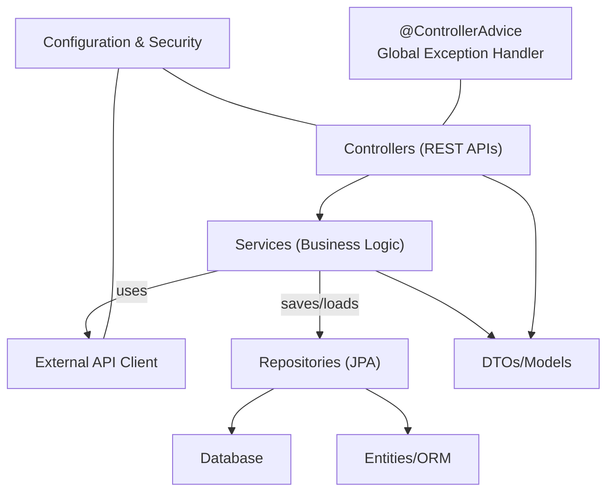
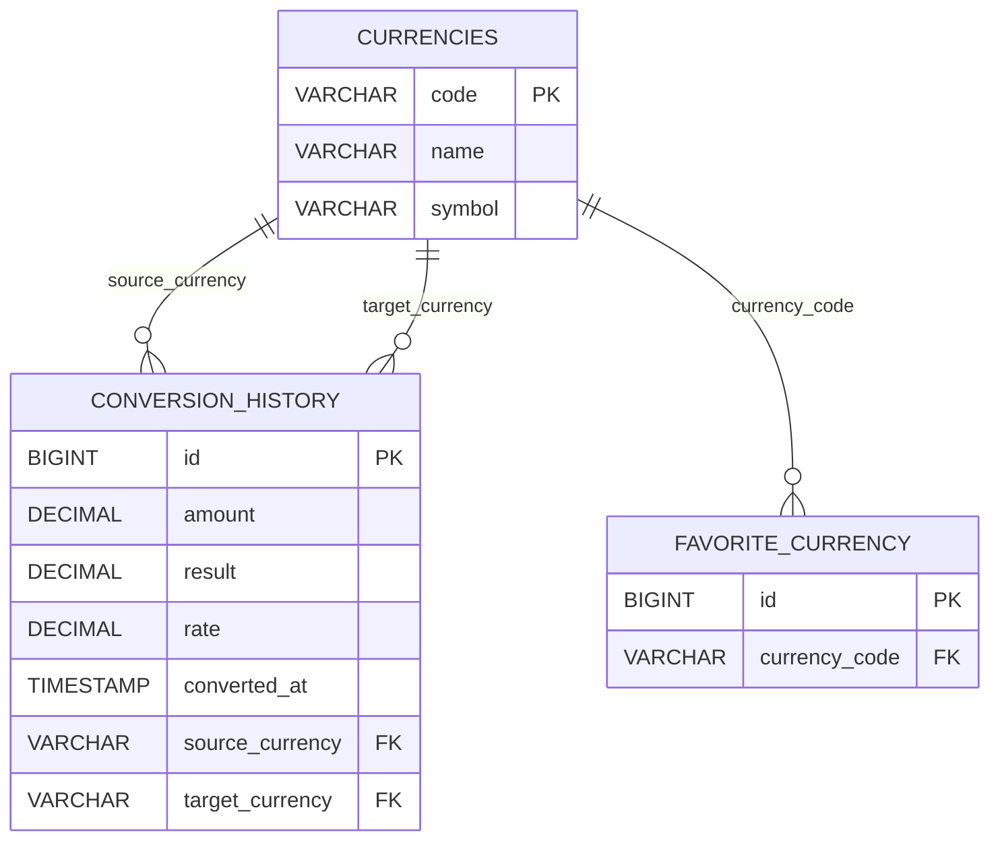
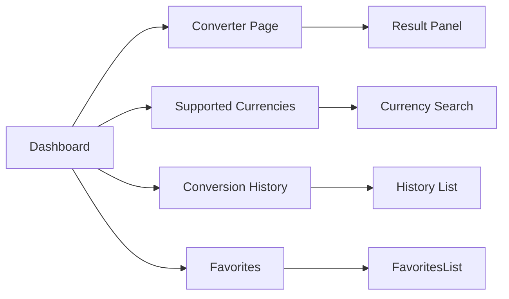

# Currency Converter Application – Software Design Document

## 1. Executive Summary

The **Currency Converter** application provides real-time currency conversion for international users. Its *purpose* is to allow users to convert amounts between any two supported currencies using up-to-date exchange rates. In today’s hyper-connected global economy, businesses and consumers demand **seamless, real-time financial interactions across borders**. Currency conversion services are vital in e-commerce and finance: displaying product prices in a customer’s local currency boosts trust and reduces cart abandonment. For example, e-commerce sites that show prices in local currencies often see *higher conversion rates* and *stronger customer loyalty*.  Likewise, travelers and international businesses rely on accurate currency conversion for budgeting and reporting.

This project serves as a **Java Full Stack Web App** (Spring Boot + React) demonstrating key software engineering concepts:

- **Layered Architecture (MVC)**: We separate concerns across layers (Controller, Service, Repository, Entity) to ensure maintainability and testability.
- **REST API Integration**: The frontend interacts with backend endpoints via REST; the backend in turn calls external exchange rate APIs (e.g. Frankfurter, ExchangeRate-API) to fetch live data.
- **External API Consumption**: The design includes an HTTP client layer for integrating third-party currency APIs, with strategies for authentication, rate limiting, retries, and fallback.
- **Error Handling & Validation**: We implement robust validation and a global exception handler (using `@ControllerAdvice`) so that invalid inputs or API failures produce clear, consistent error responses.
- **Production-Quality Practices**: The code will follow SOLID and Clean Architecture principles, use environment variables for secrets, include unit and integration testing, and provide documentation and workflows (e.g., Git strategy, CI/CD).

In summary, this project is not just a simple converter – it is designed as a **production-grade, secure, scalable currency conversion service** demonstrating full-stack best practices (layered design, API integration, responsive UI, testing, etc.).

## 2. Functional Requirements

- **Currency Conversion**: The core feature. The user selects a *source currency*, a *target currency*, and enters an *amount*. The system converts the amount using the latest exchange rate and displays the result.
- **Supported Currency List**: Show a list of all currencies supported by the system or external API (e.g. USD, EUR, JPY, GBP, etc.), including currency codes and symbols.
- **Real-Time Exchange Rates**: Fetch and display up-to-date exchange rates from an external API. The system should show the *exchange rate used* for the conversion and a timestamp of the latest data.
- **Search/Filter Currencies**: Provide a search box or filter to quickly find a currency in the list by code or name.
- **Swap Currencies**: A “swap” button to exchange the source and target currency fields in one click.
- **Clear Form**: A button to reset the converter input fields and output.
- **Conversion Output**: After conversion, display:
  - Converted amount (formatted with appropriate currency symbol).
  - Exchange rate (e.g. “1 USD = 0.85 EUR”).
  - Timestamp of the rate.
- **Conversion History**: Record each successful conversion in a history log (store in a database table). Provide a **Conversion History** page listing recent conversions (source, target, amount, result, time).
- **Favorite Currencies**: Allow the user to mark currencies as favorites. Favorites can be managed (add/remove) and displayed prominently (e.g. as quick-access on the dashboard or in a favorites list).
- **Validation**: All input fields must be validated:
  - *Amount*: required, numeric, positive (non-zero). Reject negative, zero, or non-numeric with an error.
  - *Currency Codes*: required, must be valid ISO currency codes. Show error for invalid or unsupported codes.
  - *Empty Fields*: Prompt the user if any required field is missing.
- **Error Handling**: Gracefully handle any failures:
  - If external API fails, show an error toast and disable conversion (with fallback message).
  - If input is invalid, show inline validation error messages (e.g. “Please enter a positive number”).
- **Loading Indicators**: Show spinners or loading bars while awaiting API responses (conversion or currency list fetch).
- **Toast Notifications**: Use toast/pop-up notifications for success (e.g. “Conversion successful”) and errors (e.g. “Failed to fetch rates. Try again later.”).
- **Responsive UI**: The UI must adapt to various screen sizes (mobile-first design). On mobile, stack fields vertically; on desktop, use multiple columns.
- **Dark Mode (Optional)**: Support a dark theme toggle for user comfort (maintain accessibility).
- **Offline Handling**: If the user is offline, disable conversion and show a message. (Optional: cache last rates to allow offline mode).
- **API Failure Handling**: Retry API calls with backoff; if ultimately unavailable, provide user-friendly error and possibly use cached last rates.
- **Exchange Rate Timestamp**: Always display when the rate was last updated. Allow user to refresh rates manually.
- **Future Enhancements**: (Can be listed here for completeness)
  - Historical charts of rate changes, multi-currency conversion (convert to multiple currencies at once), multiple API providers fallback, etc.

## 3. Non-Functional Requirements

- **Performance**: Conversion requests and currency list loads should respond quickly (aim <200ms response for local operations). Use caching (e.g. in-memory for rate data) if necessary to speed up frequent requests.
- **Reliability**: The app should handle failures gracefully. Integrate retry logic for API calls, and fallback to cached data if external API is temporarily down.
- **Scalability**: Architect the backend as stateless REST services so it can be scaled horizontally (multiple instances behind a load balancer). Database should be able to handle growing history logs (partitioning or archiving if needed).
- **Maintainability**: Follow **SOLID** and clean code principles. Use layered architecture and modular design so components (services, controllers, DTOs) are easy to extend or replace.
- **Security**: Protect against common web vulnerabilities:
  - **CORS**: Only allow front-end domain to access the API (or configure allowed origins appropriately).
  - **Input Validation**: Server-side check of all user inputs to prevent injection or bad data.
  - **SQL Injection**: Use ORM (JPA/Hibernate) and parameterized queries to avoid injection.
  - **XSS**: On the React side, do not use `dangerouslySetInnerHTML`. Escape any dynamic content. Use React’s built-in protections and sanitize if needed.
  - **Secrets Management**: Store API keys and DB credentials in environment variables; do not hardcode in source.
  - **Rate Limiting**: (For future) Plan to throttle conversion requests per IP if needed. Use Spring interceptors or API gateway policies.
  - **HTTPS**: Recommend deploying over HTTPS to encrypt API keys and user data in transit.
- **Responsiveness**: UI must adapt fluidly; breakpoints at mobile (≤600px), tablet, desktop. Test on multiple screen sizes to ensure usability.
- **Accessibility**: Follow WCAG guidelines (contrast ≥ 4.5:1 for text/background, semantic HTML, keyboard navigation, ARIA where needed).
- **Code Quality**: Enforce style guides and linting (e.g. SonarLint, ESLint). Code must be reviewed for clarity and duplication.
- **Readability**: Name classes/methods clearly (e.g. `CurrencyService`, `ExchangeRateDTO`). Write comments/documentation for complex logic.
- **Availability**: Design for 24/7 availability (deploy in a cloud with high uptime). Ensure DB backups and monitoring.
- **Logging & Monitoring**: Log key events (API calls, errors). Use metrics (e.g. Prometheus/Grafana) to watch uptime and performance.
- **Internationalization (Future)**: Although not required now, ensure UI text can be externalized for multi-language support later.

## 4. Software Architecture

We adopt a **layered (clean/MVC) architecture** for the backend, separating concerns as follows:

- **Controller Layer (Web/API)**: Spring `@RestController` classes handle HTTP requests, map them to JSON request/response models (DTOs), and return `ResponseEntity`s. Controllers do minimal work (parameter binding, validation) and delegate business logic to services.
- **Service Layer**: Contains business logic. Services perform currency conversion computation, call external API clients, and coordinate repositories. Example: `ConversionService.convert(...)` fetches the rate (via an HTTP client), calculates result, and saves history. Services are annotated `@Service` and may be transactional.
- **Repository (Data Access) Layer**: Spring Data JPA `@Repository` interfaces for each entity (e.g. `CurrencyRepository`, `ConversionHistoryRepository`, `FavoriteRepository`). They expose CRUD methods (or custom queries) to the underlying MySQL database.
- **Entity/Model Layer**: JPA `@Entity` classes map to database tables (e.g. `Currency`, `ConversionHistory`, `FavoriteCurrency`). Entities contain only fields and annotations for ORM. We also use DTOs (data transfer objects) to decouple internal models from exposed API models.
- **External API Client Layer**: A component (e.g. using Spring’s `RestTemplate` or `WebClient`) handles calls to the chosen exchange rate API (Frankfurter, ExchangeRate-API, etc.). We isolate it so switching APIs is easy (interface `ExchangeRateProvider` with implementations).
- **Configuration Layer**: Spring configuration classes and `application.properties` (for DB, API keys, etc.). This includes CORS and security config (e.g. Spring Security if used), and global bean setup.
- **Exception Handling Layer**: A `@ControllerAdvice` class (`GlobalExceptionHandler`) catches exceptions thrown in controllers/services and returns standardized error responses. We define custom exceptions (e.g. `CurrencyNotFoundException`, `ExternalApiException`) with meaningful HTTP statuses.
- **Validation Layer**: We use Spring’s validation annotations (e.g. `@Valid`, `@NotNull`, regex for currency codes) on request models and entities to ensure data integrity both on frontend and backend.
- **Utilities**: Helper classes (e.g. `DateTimeUtils` for formatting timestamps, `CurrencyUtils` for symbol lookup).
- **HTTP Client/Integration Layer**: The code to call external APIs (e.g. a `RestTemplate` bean configured with timeouts, authentication headers for API keys). 
- **Caching Layer (Future)**: Optionally, we could add a cache (in-memory or Redis) for exchange rates to reduce API calls and improve performance.
- **Logging Layer**: Using SLF4J/Logback for logging service operations and errors.
- **Security Layer**: Spring Security config for CORS, CSRF (if needed), and future JWT authentication support.

Below is a simplified architecture diagram (Mermaid):



- **Controller** modules (e.g. `CurrencyController`, `ConversionController`) handle HTTP routes.
- **Service Layer** modules (e.g. `CurrencyService`, `ConversionService`) encapsulate logic.
- **Repository** modules (Spring Data JPA) interface with **MySQL database**.
- **ExternalAPIClient** module fetches rates from the outside API.
- **DTOs** transfer data to/from controllers.
- **Configuration** and **Exception Handler** apply cross-cutting concerns.

## 5. Folder Structure

A clear, conventional folder layout helps organization. We propose:

```
/ (project root)
├─ backend/
│  ├─ src/main/java/com/yourcompany/currencyconverter/
│  │  ├─ controller/            # REST controllers
│  │  ├─ service/               # Business logic services
│  │  ├─ repository/            # Spring Data JPA repositories
│  │  ├─ model/
│  │  │   ├─ entity/            # JPA entities (Currency, ConversionHistory, FavoriteCurrency)
│  │  │   ├─ dto/               # Data Transfer Objects (request/response models)
│  │  ├─ exception/             # Custom exceptions and handlers
│  │  ├─ config/                # Configuration (DB, CORS, security)
│  │  ├─ util/                  # Utility classes (Date formatting, etc.)
│  │  └─ CurrencyConverterApplication.java  # Spring Boot main class
│  ├─ src/main/resources/
│  │  ├─ application.properties  # DB, API keys, etc.
│  │  └─ static/                 # (if any static resources for backend)
│  └─ src/test/java/...         # Test packages
├─ frontend/
│  ├─ node_modules/
│  ├─ public/
│  │  └─ index.html
│  ├─ src/
│  │  ├─ components/            # Reusable React components (Button, Navbar, Layout, etc.)
│  │  ├─ pages/                 # Page components (Dashboard, ConverterPage, HistoryPage, etc.)
│  │  ├─ api/                   # Axios API call modules
│  │  ├─ hooks/                 # Custom React hooks
│  │  ├─ styles/                # Tailwind CSS config or additional styles
│  │  ├─ App.jsx
│  │  └─ main.jsx
│  ├─ .env                      # Environment variables (e.g. REACT_APP_API_URL)
│  ├─ vite.config.js            # Vite configuration
│  └─ tailwind.config.js        # Tailwind configuration
├─ database/
│  ├─ schema.sql               # SQL script to initialize MySQL tables
│  └─ ERDiagram.mmd            # Mermaid ER diagram file (optional)
├─ docs/
│  ├─ design.md                # This design document
│  └─ architecture.mmd         # Mermaid diagrams (architecture, UI wireframes)
├─ postman/
│  └─ CurrencyConverter.postman_collection.json  # API endpoints collection
├─ .gitignore
├─ README.md
├─ LICENSE
└─ README_TEMPLATE.md         # Template for README if needed
```

- **Backend/** and **frontend/** are separate top-level directories. 
- **database/** holds DB schema and related scripts.
- **docs/** contains design docs and diagrams.
- **postman/** holds API testing collections.
- Environment files (`application.properties`, `.env`) store secrets using placeholders.

## 6. Database Design

We use MySQL with a few core tables:

- **currencies**: Master list of supported currencies.
  - `code` (PK, VARCHAR): ISO currency code (e.g. "USD").
  - `name` (VARCHAR): Full currency name ("US Dollar").
  - `symbol` (VARCHAR): Currency symbol ("$").
  - *Indexes:* PK on code.
  
- **conversion_history**: Records past conversions.
  - `id` (PK, BIGINT, auto-increment): Unique record ID.
  - `source_currency` (FK, VARCHAR) → currencies.code: currency converted from.
  - `target_currency` (FK, VARCHAR) → currencies.code: currency converted to.
  - `amount` (DECIMAL): Original amount.
  - `result` (DECIMAL): Converted amount.
  - `rate` (DECIMAL): Exchange rate used (target/source).
  - `converted_at` (TIMESTAMP): When conversion was done.
  - *Indexes:* PK on `id`. FKs on currency codes for integrity.
  - *Relationships:* Many-to-one to `currencies` (for both source and target).
  
- **favorite_currency**: User’s favorite currencies.
  - `id` (PK, BIGINT): Unique ID.
  - `currency_code` (FK, VARCHAR) → currencies.code: currency marked favorite.
  - *Indexes:* PK on `id`. Index on `currency_code`.
  - (If multi-user: would include `user_id` FK, but our app is single-user by design).
  
- **supported_currency** (optional): If we separate static supported list. Could be same as `currencies`.
  - In practice, `currencies` covers this.

- **api_logs** (optional): To log external API calls for auditing or rate-limits.
  - `id`, `endpoint`, `request_payload`, `response_code`, `response_body`, `timestamp`.
  - Useful for troubleshooting API errors.

Below is a simplified ER diagram (Mermaid format):



- **Data Types & Constraints**: Use `DECIMAL(18,6)` for rates (to avoid floating imprecision) and `DECIMAL(18,4)` for amounts. Enforce NOT NULL where appropriate. Add CHECK constraint `amount > 0`.
- **Indexes**: Besides primary keys, index `converted_at` in `conversion_history` for queries (e.g. show recent conversions). 
- **Normalization**: `currencies` is master table (1NF). Relationships are normalized (no redundant currency names).
- **Future Scalability**: If the history grows huge, consider partitioning by date or archiving older records. For favorite, if multi-user is added later, pivot table user_favorites would add user_id.
- **Example Entries**:
  - `currencies`: ("USD","US Dollar","$"), ("EUR","Euro","€"), etc.
  - `conversion_history`: (1, "USD","EUR", 100.00, 85.00, 0.85, "2026-07-17 18:34:10").
  - `favorite_currency`: (1, "EUR"), (2, "JPY").

## 7. REST API Design

We define RESTful endpoints under a common prefix (e.g. `/api`). All responses use JSON. Below are the key endpoints:

| Method | URL                 | Purpose                          | Request Body                            | Response (JSON)                                   | Success Codes        | Validation                  | Error Responses                              |
|--------|---------------------|----------------------------------|-----------------------------------------|---------------------------------------------------|----------------------|-----------------------------|----------------------------------------------|
| **GET**  | `/api/currencies`     | List all supported currencies      | —                                       | `[{ "code": "USD", "name": "US Dollar", "symbol": "$" }, ...]` | 200 OK               | N/A                         | 500 (DB failure)                              |
| **GET**  | `/api/currencies/{code}` | Get details of one currency        | —                                       | `{ "code": "EUR", "name": "Euro", "symbol": "€" }` | 200 OK / 404 Not Found | Code must be valid format  | 404 if not in DB; 500 if internal error.     |
| **GET**  | `/api/rates`          | Get latest exchange rates         | Query: `base=<code>&symbols=A,B`        | `{ "base":"USD", "rates": { "EUR":0.85, "GBP":0.75 }, "date":"2026-07-17" }` | 200 OK               | `base` and `symbols` format | 400 if invalid params; 502 if external API fails |
| **POST** | `/api/convert`        | Convert currency amount           | `{ "from": "USD", "to": "EUR", "amount": 100.00 }` | `{ "from": "USD", "to": "EUR", "amount":100.00, "result":85.00, "rate":0.85, "timestamp":"2026-07-17T18:34:10Z" }` | 200 OK               | See validation below         | 400 on invalid input; 502/503 if API error. |
| **GET**  | `/api/history`        | Get conversion history (recent)   | —                                       | `[{ "from":"USD", "to":"EUR", "amount":100.00, "result":85.00, "rate":0.85, "timestamp":"..." }, ...]` | 200 OK               | N/A                         | 500 if DB error.                              |
| **DELETE**| `/api/history/{id}`  | Delete a history record           | —                                       | 204 No Content                                    | 204 No Content       | id must exist              | 404 if not found; 500 if DB error.           |
| **GET**  | `/api/favorites`      | List favorite currencies          | —                                       | `["USD", "EUR", ...]` or list of objects         | 200 OK               | N/A                         | 500 if DB error.                              |
| **POST** | `/api/favorites`      | Add a currency to favorites       | `{ "currency": "JPY" }`                | `{ "message": "Added", "currency": "JPY" }`      | 201 Created           | currency valid code        | 400 if invalid; 409 if duplicate; 500 if DB.  |
| **DELETE**| `/api/favorites/{code}` | Remove from favorites            | —                                       | 204 No Content                                    | 204 No Content       | code must exist in list    | 404 if not a favorite; 500 if DB error.      |

**Validation rules** (request models):

- `from` and `to` (currency codes): must match ISO 4217 pattern (uppercase letters, 3 chars) and exist in supported list. Respond 400 if invalid/unsupported.
- `amount`: must be positive decimal > 0. Reject zero, negative, or non-numeric with 400. Use regex or numeric parsing.
- For `/api/rates`, `base` and each currency in `symbols` should be validated similarly.
- Empty fields should be flagged (400 Bad Request).

**Response structure**:
- On success, return JSON with required data.
- On error, return structured JSON: 
  ```json
  { 
    "timestamp": "...", 
    "status": 400, 
    "error": "BAD_REQUEST", 
    "message": "Invalid currency code: ABC", 
    "path": "/api/convert" 
  }
  ```
  (See Section 12 for exception format.)

**Possible errors and status codes**:
- *400 Bad Request*: Validation failed (invalid/missing input).
- *404 Not Found*: Currency code not supported (for specific currency or delete history).
- *409 Conflict*: Duplicate favorite addition.
- *502 Bad Gateway / 503 Service Unavailable*: External API is unreachable or timed out.
- *500 Internal Server Error*: Unexpected errors (database down, etc.).

Each controller method should use Spring’s `@Validated` and throw custom exceptions (e.g. `InvalidRequestException`) that our global handler maps to JSON errors.

## 8. External API Integration

We need live exchange rates from a third-party provider. The chosen API should be **free or freemium** and easy to integrate. Our options: **Frankfurter API, ExchangeRate-API, or CurrencyFreaks**. 

- **Frankfurter** (api.frankfurter.dev): 
  - *Pros*: Completely free, no API key required, no hard limits. Covers 201 currencies from 84 sources, updated daily (ECB data). Returns JSON. 
  - *Cons*: Only daily updates (sufficient for our internship), and requires client-side conversion (no direct endpoint for conversion; we multiply rate by amount).
  - *Integration*: Simple HTTP GET. Example: `GET https://api.frankfurter.dev/v2/rate/USD/EUR` returns `{"base":"USD","date":"2026-07-17","rates":{"EUR":0.85}}`. We multiply `0.85 * amount`. No auth needed (no key).
  - *Rate Limits*: Frankfurter imposes only usage throttling (no hard caps). It’s safe for development and light production.
  - *Error Handling*: Returns 404 if currency not found. We should catch HTTP errors and convert to our error format.
  
- **ExchangeRate-API** (exchangerate-api.com): 
  - *Pros*: Supports 160+ currencies, provides a conversion endpoint, hourly updates (paid) or daily (free). Has free plan with 1,500 calls/month.
  - *Cons*: Requires API key authentication. Free tier only updates rates once per day and limits base currency on free plan. 
  - *Integration*: Use their Standard endpoint for base currency or Pair Conversion endpoint. Example: `GET https://v6.exchangerate-api.com/v6/{KEY}/latest/USD` or `GET /pair/{base}/{target}/{amount}`. Returns JSON with rate and conversion.
  - *Rate Limits*: Free 1,500 calls/month. Auth via key.
  - *Docs*: Good documentation and code samples.
  
- **CurrencyFreaks** (currencyfreaks.com):
  - *Pros*: Covers 1,000+ currencies including crypto, good free plan (1000 calls/month), supports JSON/XML, hourly updates. 
  - *Cons*: Requires API key. More complex responses (includes extras).
  - *Integration*: Easy REST endpoints (latest rates, convert). JSON by default.
  - *Rate Limits*: Free 1,000 calls/month, 24h updates on free plan.
  
For this blueprint, **Frankfurter** is appealing (no keys, no limits, open source) and **ExchangeRate-API** is also robust (with free tier). We will design to support either. For production, one might choose ExchangeRate-API for richer features, but Frankfurter is simpler to start. 

**Chosen API**: We will integrate **ExchangeRate-API** for this plan (as an example) because its docs and code samples are mature. However, we’ll structure the code so swapping to Frankfurter or CurrencyFreaks is easy (via an interface).

**Authentication**: Store API key in `application.properties` (or environment). Never hardcode keys. Frontend never sees the key – all API calls go through our backend.

**Error/Retry Strategy**:
- Set a reasonable timeout (e.g. 3 seconds) on HTTP client. 
- If the call fails (timeout or network error), retry once. If still fails, throw a custom `ExternalApiException`.
- In case of failure, return HTTP 502 to frontend. The UI should show a clear message ("Rate service unavailable, try again later").
- Log all failures for monitoring.

**Mapping Response**: The external API returns JSON. We map it to our DTOs. For example, ExchangeRate-API’s `/latest` gives:
```json
{ "result": 85.00, "rate": 0.85, "base_code": "USD", "target_code": "EUR", "time_last_update_utc": "2026-07-17T00:00:00Z" }
```
We use fields: `rate` and `result`. Our conversion service will ignore or not use `result` and compute `amount * rate`, then record it. We also store the timestamp from the API (`time_last_update_utc`) for the conversion timestamp or take current server time.

**Fallback**: If the chosen API changes or fails, switching is easy:
- Use an interface `ExchangeRateProvider` in code. Implementations: `FrankfurterClient`, `ExchangeRateApiClient`, etc. They return a unified DTO (e.g. `ExchangeRateResponse { from, to, rate, timestamp }`).
- If one provider fails frequently, we can add a second provider and choose rates from either (out of scope for now).

**Example Integration Note**: The [ExchangeRate-API documentation](https://www.exchangerate-api.com/docs/overview) says their `Standard` and `Pair Conversion` endpoints are the main ones. We will likely use the Pair Conversion (submit base, target, amount) so the API does the math. Otherwise we fetch rate and multiply ourselves.

**Images**: The following images illustrate currency APIs:
 *Image: The CurrencyFreaks API dashboard highlighting its coverage of 1000+ currencies, accurate data, and global routing for low latency.*  
 *Image: ExchangeRate-API homepage touting reliable JSON currency data, 15+ years of uptime, and multiple data sources.*  
 *Image: Fixer API dashboard (example alternative) offering live and historical rates from ECB for 170+ currencies.*  
 *Image: Open Exchange Rates platform (another API) providing high-quality data for 200+ currencies, used by 100,000+ businesses.*  

These highlight options; for implementation we’ll abstract the API details behind our own service layer. The chosen provider’s details (endpoint URLs, auth) go into config.

## 9. Frontend Design

The frontend (React + Vite + Tailwind) has several key pages/components:

- **App Layout**: Common Navbar and Footer across pages.
  - *Navbar*: Links to Dashboard/Home, Supported Currencies, History, Favorites. A logo and app name on left. Dark mode toggle (if implemented).
  - *Footer*: Small footer with author/contact info or GitHub link.

- **Dashboard (Home)**:
  - Displays an overview or welcome message and quick links/buttons to main features.
  - Could show last conversion summary or top favorites.
  - Navigation to Converter and other pages.
  
- **Currency Converter Page**:
  - *Inputs*: Dropdown/select for **Source Currency**, **Target Currency**. A numeric input for **Amount**.
  - *Buttons*: “Convert”, “Swap”, “Clear”.
  - *Output*: Shows *Converted Amount*, *Exchange Rate*, *Timestamp*, *Currency Symbols*.
  - *UX*: Disable Convert if fields invalid; show a spinner while loading conversion; show error toast on failure.
  - *Responsive*: Stack fields on narrow screens.

- **Supported Currencies Page**:
  - Display a searchable/filterable **list or table** of all currencies with code, name, and symbol.
  - A search box to filter by code or name.
  - Possibly columns sortable (not required).
  - Show count of supported currencies.
  - *Empty State*: If list fails to load, show message "Unable to load currencies."

- **Conversion History Page**:
  - A table/list of recent conversions (source, amount, target, result, rate, date/time).
  - Optionally a “Clear History” button (or delete per entry).
  - Pagination or scroll if long history.
  - *Empty State*: “No conversions yet.”

- **Favorites Page**:
  - List of currency codes flagged as favorite.
  - Option to remove favorite (X button).
  - Option to click a favorite to set it quickly in converter.
  - *Empty State*: “No favorites yet.”

- **404 Page**:
  - If user goes to an unknown route, show a friendly 404 page (“Page Not Found” with link to Home).

- **Loading Screen**:
  - On app start or major page load, show a centered spinner and “Loading...” text.

- **Error Screen**:
  - If a fatal error occurs (frontend can't render), a generic error component with suggestion to refresh.

- **Toast Notifications**:
  - Show top-right (for example). Use for events like “Conversion successful”, “Currency added to favorites”, or errors like “Invalid currency code”.
  - Should auto-dismiss after a few seconds.
  - Colors: green for success, red/orange for errors.

- **Responsive Design**:
  - Mobile-first: ensure inputs and buttons are full-width on small screens.
  - Navbar collapses to hamburger on mobile.
  - Use Tailwind breakpoints (sm, md, lg, xl) to adjust layout.

- **Component Hierarchy**:
  - `App`: wraps `Routes`.
    - `Navbar`, `Footer`.
  - `DashboardPage`
  - `ConverterPage`
    - `CurrencySelector` (reusable select component)
    - `AmountInput` (with validation)
    - `SwapButton`, `ClearButton`, `ConvertButton`
    - `ResultPanel`
  - `SupportedCurrenciesPage`
    - `SearchBox`, `CurrencyTable`
  - `HistoryPage`
    - `HistoryTable`, `ClearHistoryButton`
  - `FavoritesPage`
    - `FavoritesList`
  - `NotFoundPage`
  - `LoadingSpinner` (global/spinner component).
  - `Toast` component (global container).

Below is a simple UI flow diagram (Mermaid):



*(This flowchart shows high-level navigation between pages.)*

Wireframes (sketch):
- **Converter Page**: Two dropdowns side-by-side (or stacked), amount input, convert button. Below, results box with fields for rate and time.
- **Supported**: Table with “Code” / “Name” / “Symbol”.
- **History**: Table of conversions.
- **Favorites**: Simple list of currency codes (with remove icons).

*(Wireframes would be illustrated in Mermaid class diagrams or by describing layout; full graphic mockups are not included here.)*

## 10. UI/UX Guidelines

- **Color Palette**: Use a professional, accessible palette. For example, a blue-primary (#1E40AF) and gray neutrals, with sufficient contrast. Ensure text/background contrast ≥ 4.5:1 (WCAG AA). Tailwind’s built-in colors (e.g. `text-gray-800` on `bg-gray-100`) often meet standards.
- **Typography**: Choose clean, legible fonts (e.g. default system UI or Google Fonts). Use scalable sizes (rem/em units). Headings (h1-h3) and body text sized for readability.
- **Spacing**: Use consistent spacing (e.g. Tailwind’s `p-4`, `m-2`). Group related fields with appropriate margins. Use a vertical rhythm of ~8px multiples.
- **Icons**: Use vector icons (Heroicons, FontAwesome) for UI elements like swap arrows, clear (X), search magnifier, toast close. Ensure icons have `aria-label` or titles for accessibility.
- **Layout**: 
  - *Mobile-first*: Stack content vertically by default. Use Tailwind’s responsive classes (`md:flex-row`, etc.) to adjust on larger screens.
  - *Component Hierarchy*: Build atomic components (buttons, inputs) and compose them.
- **Responsive Design**: Test at common breakpoints (375px, 768px, 1024px). Use CSS grid or flexbox. The converter form might be two columns on desktop, one column on mobile.
- **Accessibility (A11y)**:
  - Use semantic HTML tags (`<button>`, `<header>`, `<main>`, etc.). ARIA roles for complex components if needed.
  - Provide `alt` text for any images or logos.
  - Ensure keyboard navigation (tab order logical, focus styles visible).
  - Include `aria-live` region for toast notifications (to announce them to screen readers).
  - Color contrast: primary text  at least 4.5:1 on background.
- **Animations**: Use subtle transitions (e.g. button hover, modal pop-ups). Avoid distracting animations. Provide reduced-motion media query support for users who prefer reduced motion.
- **Dark Mode**: If implementing, invert backgrounds and text appropriately (gray background with white text, etc.). Tailwind’s `dark:` utilities can help.
- **Usability**: Forms should have placeholder text or labels. Buttons clearly labeled. Provide inline help or tooltips for fields if needed.
- **Professional Look**: Use a consistent design language. Align elements to a grid. Adopt a modern card or panel UI for sections.

## 11. Validation Rules

**Amount Field**:
- Must be a number (allow decimal). 
- No letters or special chars (use HTML5 `type="number"` or pattern regex).
- Must be > 0. If 0 or negative, error: “Amount must be greater than zero.”
- Client-side: use input type=number and check in React state; Server-side: @Min(0.01) or manual check.
  
**Currency Codes**:
- Dropdown should only allow valid codes (no validation needed there).
- If free text (search field), regex `^[A-Z]{3}$`. 
- If code not in `currencies` list, error: “Unsupported currency code.”
- Both source and target required and distinct (cannot convert USD→USD, or if allowed, result is trivial).
- Server: throw `InvalidCurrencyException` for bad codes.

**API Responses**:
- If API returns unexpected (null or error message), treat as error.
- Validate JSON structure (missing fields) and handle gracefully.

**Regex**:
- For currency codes: `^[A-Z]{3}$`.
- For amount: allow digits and optional decimal: `^\d+(\.\d+)?$`.

**Frontend Validation**:
- On input blur or before sending, check rules. Disable Convert until valid.
- Show inline error messages under fields.

**Backend Validation**:
- Use Spring’s `@Valid` on request DTO with annotations:
  ```java
  @NotBlank @Pattern(regexp="^[A-Z]{3}$") String from;
  @NotBlank @Pattern(regexp="^[A-Z]{3}$") String to;
  @NotNull @DecimalMin("0.01") BigDecimal amount;
  ```
- In service, also check `currencyRepository.existsById(code)`. If not, throw custom exception.

**Error Messages**:
- Keep them user-friendly: “Please enter a number above 0.”, “Currency code ‘XYZ’ not supported.”.
- Avoid technical jargon.

## 12. Exception Handling Strategy

We will use a **global exception handler** (`@ControllerAdvice`) to centralize error responses. 

- **Custom Exceptions**: Define specific exception classes:
  - `ResourceNotFoundException` (e.g. currency not found, history ID missing).
  - `ValidationException` (invalid input).
  - `ExternalApiException` (upstream API errors).
  - `DatabaseException` (if DB operation fails).
  - `DuplicateResourceException` (e.g. favorite already exists).
- **@ControllerAdvice Handler**: One class with `@ExceptionHandler` for each:
  - 404: `ResourceNotFoundException` → return `HttpStatus.NOT_FOUND`.
  - 400: `ValidationException`, `MethodArgumentNotValidException` (Spring’s validation) → `BAD_REQUEST`.
  - 502/503: `ExternalApiException` → `BAD_GATEWAY` or `SERVICE_UNAVAILABLE`.
  - 500: catch-all `Exception` → `INTERNAL_SERVER_ERROR`.
- **Response Format**: Return a JSON with fields like:
  ```json
  {
    "timestamp": "2026-07-17T19:00:00Z",
    "status": 400,
    "error": "BAD_REQUEST",
    "message": "Amount must be greater than zero",
    "path": "/api/convert",
    "details": { ... } // optional additional data
  }
  ```
  (Include `details` for validation errors).
- **Stack Traces**: In production, do not expose internal stack traces. Only return user-friendly messages.
- **Logging**: Log exceptions on server side. E.g. for `Exception.class`, log at ERROR level with trace ID.
- **Trace IDs**: (Optional) Implement a UUID trace ID for each request (store in MDC) so errors can be correlated. Return it in error JSON for support.

**Example Handler**:
```java
@ControllerAdvice
public class GlobalExceptionHandler {
    @ExceptionHandler(ResourceNotFoundException.class)
    public ResponseEntity<ErrorResponse> handleNotFound(ResourceNotFoundException ex, WebRequest req) {
        ErrorResponse err = new ErrorResponse(HttpStatus.NOT_FOUND, ex.getMessage(), req.getDescription(false));
        return new ResponseEntity<>(err, HttpStatus.NOT_FOUND);
    }
    @ExceptionHandler(ValidationException.class)
    public ResponseEntity<ErrorResponse> handleValidation(ValidationException ex, WebRequest req) {
        ErrorResponse err = new ErrorResponse(HttpStatus.BAD_REQUEST, ex.getMessage(), req.getDescription(false));
        return new ResponseEntity<>(err, HttpStatus.BAD_REQUEST);
    }
    @ExceptionHandler(ExternalApiException.class)
    public ResponseEntity<ErrorResponse> handleApiError(ExternalApiException ex, WebRequest req) {
        ErrorResponse err = new ErrorResponse(HttpStatus.BAD_GATEWAY, "External exchange rate service error", req.getDescription(false));
        return new ResponseEntity<>(err, HttpStatus.BAD_GATEWAY);
    }
    @ExceptionHandler(Exception.class)
    public ResponseEntity<ErrorResponse> handleGeneral(Exception ex, WebRequest req) {
        // Log ex internally
        ErrorResponse err = new ErrorResponse(HttpStatus.INTERNAL_SERVER_ERROR, "An unexpected error occurred", req.getDescription(false));
        return new ResponseEntity<>(err, HttpStatus.INTERNAL_SERVER_ERROR);
    }
}
```
*(We follow best practices: no stack trace in client response, consistent structure, etc.)*

## 13. Security

The application should follow standard web security practices:

- **CORS**: Configure CORS in Spring Boot so only the frontend origin (e.g. http://localhost:3000 or production URL) can access the API. This is done via `@CrossOrigin(origins = "...")` on controllers or a global CORS config bean. For example:
  ```java
  @Bean
  public WebMvcConfigurer corsConfigurer() {
      return new WebMvcConfigurer() {
          @Override
          public void addCorsMappings(CorsRegistry registry) {
              registry.addMapping("/api/**").allowedOrigins("http://localhost:3000");
          }
      };
  }
  ```
- **Input Sanitization**: Beyond validation, never trust user input. For example, sanitize text inputs that might be used in HTML (though our use-case is limited).
- **SQL Injection Prevention**: Using Spring Data JPA prevents raw SQL concatenation. Always use parameters or repository methods. (Follow OWASP guidelines: always use prepared statements).
- **XSS Protection**: React by default escapes inserted values. Do not dangerously insert HTML. Ensure any user-displayed data (e.g. currency names) is safe (but names are from DB).
- **Secret Management**: 
  - **Backend**: Store database credentials and API keys in `application.properties` with placeholders, then set actual values via environment variables or a secure vault. Add them to `.gitignore`.
  - **Frontend**: Store API base URL in `.env` (e.g. `VITE_API_URL=http://localhost:8080`) and do not commit keys here.
- **HTTPS**: Always serve via HTTPS in production. Ensure API key transit is encrypted.
- **API Key Protection**: Do not expose the external API key to the frontend. All API calls happen from the backend, which holds the key.
- **Rate Limiting**: Consider basic throttling (e.g. max 100 requests per minute) to mitigate abuse. Can use libraries like Bucket4j in Spring.
- **Authentication (Future)**: Although not required now, design the code with future JWT-based auth in mind (e.g. user login to save personal history). Mark security-related classes modular so you can add Spring Security later.
- **Dependencies**: Keep libraries up to date. For example, use the latest Spring Boot (2.7+ or 3.x) and check for CVEs.

## 14. Development Roadmap

Break the project into iterative milestones. Each milestone can be tested independently.

**Milestone 1 – Project Setup**
- Initialize Git repository.
- Create Maven project with Spring Boot (Java 21).
- Add dependencies: Spring Web, Spring Data JPA, MySQL Driver, Validation, DevTools.
- Configure `application.properties` (placeholders for DB URL, user, pass).
- Create base packages (controller, service, repository, model).
- Commit: “Initial project setup with Spring Boot”.

**Milestone 2 – Database Setup & Currency Entity**
- Set up MySQL schema (create database `currencydb`).
- Create `Currency` entity (fields: code, name, symbol).
- Create `CurrencyRepository` (extends JpaRepository).
- Create `schema.sql` to insert some base currencies or rely on JPA `data.sql`.
- Test: Verify Spring Boot connects to DB on startup and table created.
- Commit: “Add Currency entity and repository; configure MySQL connection”.

**Milestone 3 – External API Client Configuration**
- Add HTTP client (e.g. Spring `RestTemplate` or `WebClient` bean).
- Configure properties for external API base URL and key.
- Write a simple `ExchangeRateApiClient` class that calls a test endpoint (e.g. fetch USD->EUR rate).
- Write unit test or simple main to ensure HTTP call works.
- Commit: “Configure HTTP client for exchange rate API”.

**Milestone 4 – Conversion Service Logic**
- Create `ConversionService` with method `convert(String from, String to, BigDecimal amount)`.
- In service, fetch rate from external API client, calculate result, and return a DTO (`ConversionResultDTO`).
- Define DTO with fields for rate, result, timestamp.
- Handle exceptions (wrap HTTP errors in our `ExternalApiException`).
- Unit test: Mock API client, test conversion math.
- Commit: “Implement conversion logic in service using external API”.

**Milestone 5 – Conversion REST Controller**
- Create `ConversionController` with `POST /api/convert`.
- Use `@Valid` request DTO (`ConversionRequest` with from, to, amount).
- Call `ConversionService.convert(...)` and return response.
- Test with Postman: send request, verify JSON output.
- Add validation (e.g. `@Pattern`, `@DecimalMin`) to request DTO.
- Handle validation exceptions globally.
- Commit: “Add /convert endpoint with validation”.

**Milestone 6 – Currency Endpoints**
- Implement `CurrencyController`: 
  - `GET /api/currencies` returns all from `CurrencyRepository.findAll()`.
  - `GET /api/currencies/{code}` returns one or 404.
- Seed the `currencies` table with data (e.g. via `data.sql` or manual insert).
- Test endpoints with Postman.
- Commit: “Currency lookup endpoints and sample data”.

**Milestone 7 – Swap and Form Actions on Frontend**
- Set up React project with Vite.
- Install Tailwind CSS.
- Create basic Converter page UI (dropdowns, input, buttons).
- Create `CurrencySelector` and use state hooks.
- Implement swap and clear button handlers.
- Commit: “Initialize React project and build basic converter UI”.

**Milestone 8 – Axios Integration (Frontend)**
- Install Axios.
- Create `api.js` with Axios instance pointing to backend.
- In Converter page, implement form submit to call `/api/convert`.
- Display loading state and result on success.
- Show toast on error.
- Commit: “Integrate frontend form with backend convert API (Axios)”.

**Milestone 9 – History Module**
- Backend: Create `ConversionHistory` entity and `ConversionHistoryRepository`. In `ConversionService`, save each conversion result to DB.
- Add `GET /api/history` and `DELETE /api/history/{id}` endpoints.
- Frontend: Add HistoryPage component, fetch history on load, display in table.
- Commit: “Implement conversion history persistence and API”.

**Milestone 10 – Favorites Module**
- Backend: `FavoriteCurrency` entity and repository.
- Endpoints: `GET /api/favorites`, `POST /api/favorites`, `DELETE /api/favorites/{code}`.
- Frontend: Add FavoritesPage; allow marking favorites from UI (e.g. star icon next to currency).
- Commit: “Add favorite currencies feature with API”.

**Milestone 11 – Supported Currencies Page**
- Backend: Ensure `GET /api/currencies` is working.
- Frontend: Add SupportedCurrenciesPage; use table and search/filter on currencies.
- Commit: “Display list of supported currencies (frontend)”.

**Milestone 12 – UI Enhancements**
- Add loading spinners on API calls.
- Add toast notifications (use a library or custom component).
- Add dark mode toggle (optional).
- Ensure responsive (test and fix layout on mobile).
- Commit: “Add loading indicators, toasts, and responsive design”.

**Milestone 13 – Testing & Polish**
- Write unit tests for services (mock external API).
- Write integration tests for controllers (SpringBootTest + H2 DB).
- Validate error handling paths.
- Prepare Postman collection with all endpoints.
- Final bug fixes and UI polish.
- Commit: “Add tests and finalize UI; ready for deployment”.

## 15. Git Strategy

A clean Git workflow:

- **Branches**: Use *feature branches* off `main` (or `develop`). Branch names like `feature/converter-endpoint` or `fix/api-error-handling`.
- **Commits**: Follow conventional commits: prefix with `feat:`, `fix:`, `chore:`, etc.. Write present-tense, imperative messages (e.g. “Add converter service layer”).
- **Pull Requests**: Use PRs for merging into `main`. Each PR should be small (one feature/fix). Require at least one peer review.
- **Code Review**: Ensure code style compliance, no sensitive data in commits, unit tests added.
- **Tags/Releases**: Tag milestones (e.g. `v1.0.0`) when ready to release. Use semantic versioning.
- **CI**: (Future) Setup GitHub Actions to run tests on push.
- **Issue Tracking**: Use GitHub Issues for bugs and tasks. Milestones correspond to development roadmap.
- **README**: Keep README up-to-date with project info (see next section).

## 16. Professional GitHub README Outline

A high-quality README to accompany the repo might include:

- **Project Title & Badges** (build status, license, etc).
- **Overview**: Brief description of the app and its purpose.
- **Demo GIF/Screenshots**: Show the UI in action.
- **Features**: List key features (conversion, history, favorites, etc).
- **Architecture Diagram**: A small block diagram or link to `docs`.
- **Tech Stack**: Java 21, Spring Boot, React, Tailwind, MySQL, etc.
- **Setup / Installation**:
  - Pre-requisites (Java, Node, MySQL).
  - How to clone, build, and run (backend and frontend).
  - Database setup (schema).
- **Environment Variables**: List `.env`/`application.properties` keys needed.
- **API Usage**: Short examples of endpoints (link to API docs or Postman).
- **Folder Structure**: Outline of important directories.
- **Scripts**: Build/test commands.
- **Deployment**: Steps for hosting (e.g. Render, Railway, Vercel).
- **Authors/Maintainers**: Name (your name) and contact.
- **License**: (e.g. MIT).
- **Acknowledgments / References**.

This follows common guidelines: start with purpose, show usage, then details on running.

## 17. Demo Video Plan

Create a short (5–7 min) walkthrough video:

1. **Introduction (30s)**: Show the app name/logo. State that it’s a production-quality Currency Converter (full-stack).
2. **Backend Walkthrough (1 min)**: 
   - Show the Spring Boot service in IDE (e.g. controller and service code).
   - Explain layered structure (Controller → Service → External API).
   - Demonstrate API calls via Postman:
     - GET /api/currencies returns list.
     - POST /api/convert with sample data.
     - Show JSON response.
3. **Frontend Walkthrough (2-3 min)**:
   - Show the React app in browser.
   - Demonstrate converting currencies (e.g. 100 USD to EUR). Show rate and timestamp.
   - Swap currencies button working.
   - Show supported currencies page: search/filter.
   - Show history page (after making a few conversions).
   - Show adding a favorite and viewing favorites.
   - Show error handling: e.g. enter invalid currency and see validation message; disconnect internet to simulate API failure and show error toast.
   - Resize browser to mobile width to demonstrate responsiveness.
4. **Talking Points**:
   - Emphasize tech: Java 21, Spring Boot, React, Axios, Tailwind, MySQL.
   - Mention real-time API integration and layering.
   - Highlight error handling (Toast, form validation).
   - Mention it's built as a full production blueprint (e.g. coded by a *Software Architect*).
5. **Conclusion (30s)**:
   - Summary of achievements.
   - Next steps or future enhancements.
6. **Duration**: Aim ~6 minutes total (quick but complete).

Use clear voiceover. Possibly show code snippets briefly when talking about architecture. 

## 18. LinkedIn Post Outline

*Title:* **Built: Production-Quality Currency Converter Web App (Java • Spring Boot • React)**

*Content Points:*
- Announcement of project completion as part of Java Virtual Internship (CodSoft).
- Technologies: Java 21, Spring Boot REST API, React (Vite), Tailwind CSS, MySQL.
- Highlights:
  - Real-time exchange rates via external API integration.
  - Full-featured UI: currency search, swap, history, favorites, responsive design.
  - Demonstrated clean architecture and best practices (layered design, DTOs, validation).
  - Handled error cases and built production-ready code.
- Express excitement: “Happy to share my latest full-stack project: a global currency converter app! This app fetches live rates and lets users convert between any currencies. It features a polished dashboard, conversion history, and more.”
- Call-to-action: perhaps link to GitHub repository or video demo.
- Gratitude: Mentions internship experience or mentors (if any).
- Keywords: Java, Spring Boot, REST API, React, Full Stack, API Integration, Tailwind, MySQL, System Design.
- Length: ~100–150 words, professional tone.

Example excerpt:  
> “Excited to announce my new project: a **Currency Converter Web App** built with Java 21 (Spring Boot) and React. 🚀 It fetches **real-time exchange rates** (via API), and demonstrates full production-grade features: a sleek UI (Tailwind CSS), conversion history, favorites, and responsive design. I implemented a clean layered architecture with robust validation and error handling. This project showcases my full-stack skills and attention to clean code and best practices. Check it out on GitHub! #Java #SpringBoot #React #API #FullStack #DevPortfolio”  

## 19. Resume Bullet Points

- Designed and implemented a **full-stack Currency Converter** web application (Java 21, Spring Boot, React, Tailwind, MySQL) with live exchange rate integration via external APIs.
- Developed RESTful services (controllers, service layer, repository) demonstrating clean, layered architecture and SOLID principles.
- Integrated third-party **ExchangeRate-API** for real-time currency rates, handling API keys securely and implementing fallback on failures.
- Built responsive UI using React (Vite) and Tailwind CSS; included advanced features: search/filter currencies, swap, conversion history, and favorites.
- Implemented comprehensive validation (DTOs, regex) and global exception handling (`@ControllerAdvice`) to deliver robust, production-quality code.
- Emphasized code quality with unit/integration testing, Git workflow (feature branches, PRs), and detailed documentation (README, postman collection).
- Demonstrated end-to-end **system design** (ER diagram, caching strategy, security considerations) appropriate for high availability and scale.

## 20. Testing Strategy

- **Unit Testing**:
  - Backend: Use JUnit + Mockito. Test service layer logic by mocking the repository and external API client. E.g. test conversion calculation, validation logic.
  - Test each custom exception is thrown correctly.
- **Integration Testing**:
  - Spring Boot tests (`@SpringBootTest`) with an in-memory database (H2) for repository and controller endpoints. Verify full request-response cycle.
- **Frontend Testing**:
  - Manual functional testing: click through UI flows to ensure everything works.
  - Automated (optional): React Testing Library for critical components (validate form input logic, loading state).
- **API Testing (Postman)**:
  - Create a collection for all endpoints. Include tests for valid and invalid cases.
  - Test history endpoints (GET, DELETE) to ensure correct status codes.
- **External API Testing**:
  - Simulate API downtime: e.g. point to invalid URL or disconnect and check the app shows error toast.
- **Edge Cases**:
  - Convert amount = 0, negative, or extremely large numbers.
  - Unsupported currency codes (e.g. “XYZ”).
  - Swap with same currency.
  - Empty form submission.
- **Performance Testing**:
  - (Optional) Use JMeter or scripts to simulate multiple conversion requests, ensure app handles it (and consider caching if needed).
- **Security Testing**:
  - Verify CORS only allows permitted origin.
  - Attempt SQL injection-like input (should fail validation).
  - Check XSS by entering `<script>` in any fields (should be sanitized or rejected).
- **Accessibility Testing**:
  - Use a checker (e.g. Lighthouse) to ensure contrast and alt text requirements.
  - Keyboard-only navigation: can user tab through all controls?
- **Manual Review**:
  - Test on multiple browsers (Chrome, Firefox).
  - Test UI on mobile device or emulator.
  
## 21. Future Scope

Potential enhancements beyond internship requirements:

- **User Authentication & Roles**: Add login/register (Spring Security + JWT). Each user’s conversion history and favorites separate.
- **Charts & Analytics**: Provide historical charts of currency rates (e.g. using Chart.js) for visualization.
- **Multiple API Providers**: Implement fallback or compare rates from two APIs (Frankfurter vs. ExchangeRate) to improve reliability.
- **Caching with Redis**: Cache exchange rates for a short duration to reduce API calls and speed up responses.
- **Dockerization**: Containerize the application (Dockerfile for backend and frontend) for easy deployment.
- **CI/CD Pipeline**: Set up automated build/deploy (GitHub Actions to Docker Hub or cloud).
- **Cloud Deployment**: Deploy backend and database on cloud (AWS/GCP/Azure) with managed DB. Frontend on Vercel/Netlify.
- **Microservices**: Split features into microservices (Auth Service, Currency Service, History Service) for scalability.
- **Rate Limit Middleware**: Enforce per-user or per-IP rate limits (e.g. with Spring AOP or API Gateway).
- **Email Notifications**: On user registration or conversion alerts.
- **Mobile App**: Build a companion mobile app (React Native/Flutter) using the same APIs.
- **Audit Logs**: More extensive logging of user actions for compliance (which currency was converted by which user).
- **Additional Currencies**: Support crypto (if API provides) and commodities (gold/silver).
- **Internationalization**: Translate UI into multiple languages.
- **CLI Tool**: A simple command-line interface for conversion using the same backend API.

## 22. Google Antigravity Development Prompts

*(Each prompt below is phrased as an instruction to the AI coder, Google Antigravity, to implement one milestone. They specify goals, files, constraints, and testing criteria.)*

**Prompt 1: Initialize Spring Boot Backend**  
- **Goal:** Create a new Spring Boot (Java 21) application.  
- **Files to Create:** Maven `pom.xml`, `src/main/java/com/yourcompany/currencyconverter/CurrencyConverterApplication.java`.  
- **Files to Modify:** N/A.  
- **Coding Standards:** Follow Java naming conventions (CamelCase for classes). Use package `com.yourcompany.currencyconverter`.  
- **Architecture Constraints:** Must be a Spring Boot application with main class annotated `@SpringBootApplication`.  
- **Acceptance Criteria:** Project compiles and starts (returning default error page at root).  
- **Testing Checklist:** Run `mvn spring-boot:run` and ensure no errors. Endpoint `/actuator/health` returns “UP”.  
- **Commit Message:** `chore: initialize Spring Boot application`  

**Prompt 2: Configure MySQL Connection**  
- **Goal:** Set up application to use MySQL.  
- **Files to Create:** `src/main/resources/application.properties`.  
- **Files to Modify:** `pom.xml` (add MySQL, JPA dependencies).  
- **Coding Standards:** Use Spring’s standard properties (`spring.datasource.url`, etc).  
- **Architecture Constraints:** Use Spring Data JPA.  
- **Acceptance Criteria:** On startup, Spring Boot connects to MySQL and creates schema (or errors if not).  
- **Testing Checklist:** Provide correct DB URL; run app and check that a `currencies` table can be created.  
- **Commit Message:** `feat: add MySQL database configuration and dependencies`  

**Prompt 3: Create Currency Entity & Repository**  
- **Goal:** Model the supported currencies.  
- **Files to Create:** `Currency.java` (JPA entity in `model/entity`), `CurrencyRepository.java`.  
- **Files to Modify:** `application.properties` (for JPA settings).  
- **Coding Standards:** Entity fields: `code` (PK, String), `name`, `symbol`. Use `@Entity` and `@Id`.  
- **Architecture Constraints:** Use JPA repository interface. `CurrencyRepository extends JpaRepository<Currency, String>`.  
- **Acceptance Criteria:** Ability to save and retrieve a `Currency` via repository.  
- **Testing Checklist:** Write a test to `save(new Currency("USD","US Dollar","$"))` and `findById("USD")` returns it.  
- **Commit Message:** `feat: add Currency entity and JPA repository`  

**Prompt 4: Populate Supported Currencies**  
- **Goal:** Insert initial currency data into the database.  
- **Files to Create:** `data.sql` (in `resources`) or migration script.  
- **Files to Modify:** N/A.  
- **Coding Standards:** Use standard SQL `INSERT`.  
- **Architecture Constraints:** Ensure it runs on startup (Spring runs `data.sql`).  
- **Acceptance Criteria:** On app start, table `currencies` contains rows (e.g. USD, EUR).  
- **Testing Checklist:** Query the `currencies` table via MySQL client or repository and verify entries exist.  
- **Commit Message:** `chore: seed supported currencies into database`  

**Prompt 5: Implement External API Client**  
- **Goal:** Create a service to fetch exchange rates from the external API.  
- **Files to Create:** `ExchangeRateApiClient.java` in `service/external/`.  
- **Files to Modify:** `application.properties` (add `api.key`, `api.url`).  
- **Coding Standards:** Use `@Component` or `@Service`, `RestTemplate` or `WebClient`.  
- **Architecture Constraints:** Abstract via interface `ExchangeRateProvider`.  
- **Acceptance Criteria:** Method `BigDecimal getExchangeRate(String from, String to)` returns correct rate.  
- **Testing Checklist:** Mock a RestTemplate call in a unit test to return a known rate JSON; verify the client parses it.  
- **Commit Message:** `feat: add external exchange rate API client`  

**Prompt 6: Define Conversion DTOs**  
- **Goal:** Create request/response models for conversion.  
- **Files to Create:** `ConversionRequest.java` (with fields `from, to, amount`), `ConversionResponse.java` (fields `from, to, amount, result, rate, timestamp`).  
- **Files to Modify:** `CurrencyConverterApplication.java` (enable validation).  
- **Coding Standards:** Use Lombok or explicit getters/setters. Add validation annotations (`@NotBlank`, `@Pattern`, `@DecimalMin`).  
- **Architecture Constraints:** DTOs must not be JPA entities. They go in `model/dto`.  
- **Acceptance Criteria:** Request DTO is validated (Spring rejects bad input).  
- **Testing Checklist:** Test validation by sending blank or invalid values to controller (later).  
- **Commit Message:** `feat: add DTOs for currency conversion request and response`  

**Prompt 7: Conversion Logic in Service**  
- **Goal:** Implement the business logic to perform currency conversion.  
- **Files to Create:** `ConversionService.java`.  
- **Files to Modify:** `ExchangeRateApiClient.java` (if needed for conversion), create custom exception classes.  
- **Coding Standards:** Separation of concerns – service should call client, perform math, and throw `ExternalApiException` on API errors.  
- **Architecture Constraints:** Inject `ExchangeRateProvider` interface.  
- **Acceptance Criteria:** `convert()` method returns correct result.  
- **Testing Checklist:** Mock `ExchangeRateProvider` to return a fixed rate, verify `ConversionService.convert("USD","EUR",100)` returns 85 (for rate 0.85).  
- **Commit Message:** `feat: implement currency conversion logic in service layer`  

**Prompt 8: Conversion Controller Endpoint**  
- **Goal:** Expose `/api/convert` POST endpoint.  
- **Files to Create:** `ConversionController.java`.  
- **Files to Modify:** `ConversionService.java` (if needed).  
- **Coding Standards:** Use `@RestController` and `@PostMapping("/api/convert")`. Accept `@Valid ConversionRequest`. Return `ConversionResponse` with 200 status.  
- **Architecture Constraints:** Minimal logic in controller; delegate to service.  
- **Acceptance Criteria:** Posting valid JSON returns correct response.  
- **Testing Checklist:** Use Postman or a unit test to POST `{"from":"USD","to":"EUR","amount":100}` and expect a JSON with result, rate, timestamp.  
- **Commit Message:** `feat: add /api/convert REST endpoint`  

**Prompt 9: Input Validation**  
- **Goal:** Add validation rules to avoid invalid inputs.  
- **Files to Create:** Custom exceptions for validation (e.g. `InvalidCurrencyException`).  
- **Files to Modify:** `ConversionRequest.java` (add validation annotations), `CurrencyController` (later, validate currency codes).  
- **Coding Standards:** Use Java Bean Validation. No business logic in controller.  
- **Architecture Constraints:** Rely on `@Valid` and exception handler to catch violations.  
- **Acceptance Criteria:** Invalid requests (e.g. negative amount) yield HTTP 400 with error message.  
- **Testing Checklist:** Attempt POST with invalid amount or currency; ensure response status 400.  
- **Commit Message:** `fix: add request validation and error handling`  

**Prompt 10: Global Exception Handling**  
- **Goal:** Implement a `@ControllerAdvice` to handle exceptions globally.  
- **Files to Create:** `GlobalExceptionHandler.java` in `exception` package.  
- **Files to Modify:** None (just add this class).  
- **Coding Standards:** Map custom exceptions to HTTP codes.  
- **Architecture Constraints:** Use consistent JSON error format.  
- **Acceptance Criteria:** Throwing a `ResourceNotFoundException` returns a JSON with status 404.  
- **Testing Checklist:** Simulate a thrown exception in controller (by calling nonexistent currency) and check JSON error.  
- **Commit Message:** `feat: add global exception handler for consistent API errors`  

**Prompt 11: Initialize React Frontend**  
- **Goal:** Set up the React (Vite) project with Tailwind CSS.  
- **Files to Create:** Run `npm create vite@latest frontend --template react`.  
- **Files to Modify:** `tailwind.config.js`, add Tailwind directives in CSS.  
- **Coding Standards:** Use JSX and functional components.  
- **Architecture Constraints:** Set up routing (React Router) for pages.  
- **Acceptance Criteria:** App runs on `npm run dev` showing default Vite page.  
- **Testing Checklist:** Manually check UI loads with “Vite + React + Tailwind” page.  
- **Commit Message:** `chore: initialize React + Vite frontend with Tailwind`  

**Prompt 12: Build Converter UI**  
- **Goal:** Create ConverterPage component with inputs and buttons.  
- **Files to Create:** `ConverterPage.jsx`, `components/CurrencySelector.jsx`, `components/ResultDisplay.jsx`.  
- **Files to Modify:** `App.jsx` (add route).  
- **Coding Standards:** Use React Hooks for state. Tailwind for styling.  
- **Architecture Constraints:** Form should disable submit when invalid.  
- **Acceptance Criteria:** Dropdowns for currency (hardcode few first), amount input, “Convert” button visible.  
- **Testing Checklist:** Display in browser; verify swap and clear buttons clear and swap fields.  
- **Commit Message:** `feat: implement converter UI components`  

**Prompt 13: Axios Integration (Frontend)**  
- **Goal:** Connect frontend to backend `/api/convert`.  
- **Files to Create:** `api/converterApi.js`.  
- **Files to Modify:** `ConverterPage.jsx` (call API on submit).  
- **Coding Standards:** Use async/await. Show loading spinner while waiting.  
- **Architecture Constraints:** Base URL from env `import.meta.env.VITE_API_URL`.  
- **Acceptance Criteria:** Conversions from frontend show correct result (matches backend).  
- **Testing Checklist:** Enter amount and currencies; confirm result updates. Simulate error (e.g. disconnect) and check error toast appears.  
- **Commit Message:** `feat: connect converter UI to backend via Axios`  

**Prompt 14: Conversion History Page**  
- **Goal:** Display past conversions.  
- **Files to Create:** `HistoryPage.jsx`, `components/HistoryTable.jsx`.  
- **Files to Modify:** `ConversionService.java` (save each conversion to DB).  
- **Coding Standards:** Backend: JPA entity `ConversionHistory`. Frontend: fetch `/api/history`.  
- **Architecture Constraints:** History should be retrievable without user auth (for now global history).  
- **Acceptance Criteria:** After a conversion, visiting HistoryPage shows that record.  
- **Testing Checklist:** Perform a conversion, go to HistoryPage, see entry. Test “Clear History” deletes an entry.  
- **Commit Message:** `feat: implement conversion history backend and frontend page`  

**Prompt 15: Favorites Page**  
- **Goal:** Let users mark and view favorite currencies.  
- **Files to Create:** `FavoritesPage.jsx`, `components/FavoritesList.jsx`.  
- **Files to Modify:** `CurrencyController.java` (endpoints for favorites). `FavoriteCurrency` entity.  
- **Coding Standards:** POST `/api/favorites` and DELETE `/api/favorites/{code}`.  
- **Architecture Constraints:** One global favorites list (or per session).  
- **Acceptance Criteria:** Can click “favorite” on a currency and it appears in FavoritesPage.  
- **Testing Checklist:** Add and remove favorites; test API and UI reflect changes.  
- **Commit Message:** `feat: add favorite currencies functionality`  

**Prompt 16: Supported Currencies Page**  
- **Goal:** Show all supported currencies and enable search.  
- **Files to Create:** `SupportedPage.jsx`, `components/CurrencyTable.jsx`.  
- **Files to Modify:** None (frontend only).  
- **Coding Standards:** Efficient filtering (use React state).  
- **Architecture Constraints:** Fetch from `/api/currencies`.  
- **Acceptance Criteria:** All currencies from DB appear, search box filters them in real time.  
- **Testing Checklist:** Ensure list loads and searching hides others.  
- **Commit Message:** `feat: display supported currencies list with search`  

**Prompt 17: Toast Notification Component**  
- **Goal:** Implement a reusable Toast/Alert component.  
- **Files to Create:** `components/Toast.jsx`.  
- **Files to Modify:** Use Toast in various pages (ConverterPage, HistoryPage).  
- **Coding Standards:** Accessible ARIA (role="alert"). Auto-dismiss after timeout.  
- **Architecture Constraints:** Global context or component state to trigger toasts.  
- **Acceptance Criteria:** Calling toast triggers a message box on screen.  
- **Testing Checklist:** Trigger success and error toasts; ensure they appear/disappear.  
- **Commit Message:** `feat: add toast notifications for user feedback`  

**Prompt 18: Loading Indicator**  
- **Goal:** Show loading spinner during API calls.  
- **Files to Create:** `components/LoadingSpinner.jsx`.  
- **Files to Modify:** Add state in pages to toggle spinner (e.g. disable form during convert).  
- **Coding Standards:** Use accessible spinner (e.g. `role="status"`).  
- **Architecture Constraints:** Should cover relevant section (or full page when necessary).  
- **Acceptance Criteria:** Spinner visible while waiting for backend.  
- **Testing Checklist:** Observe spinner on slow network; ensure disappears after data loads.  
- **Commit Message:** `feat: add loading spinner for async operations`  

**Prompt 19: Responsive Design & CSS Fixes**  
- **Goal:** Ensure app looks good on mobile.  
- **Files to Modify:** CSS classes in pages (use Tailwind responsive utilities).  
- **Coding Standards:** Mobile-first layout adjustments.  
- **Architecture Constraints:** No horizontal scroll; elements adapt to small width.  
- **Acceptance Criteria:** UI usable and not broken at 320px width.  
- **Testing Checklist:** Use browser DevTools to simulate mobile; fix any layout bugs.  
- **Commit Message:** `fix: refine responsive layout and styles`  

**Prompt 20: Deployment Configuration**  
- **Goal:** Prepare app for deployment.  
- **Files to Create:** `Dockerfile` (optional), or config for Render/Railway.  
- **Files to Modify:** CI workflow (if needed).  
- **Coding Standards:** Use environment variables for all secrets.  
- **Architecture Constraints:** Application should run with `java -jar` and `npm build`.  
- **Acceptance Criteria:** Able to deploy on chosen platform (e.g. using instructions).  
- **Testing Checklist:** Push to a deployment service and verify app is reachable.  
- **Commit Message:** `chore: add deployment configuration`  

*(Continue similarly until all features are implemented as production-quality. Each prompt should result in code ready for commit and testing.)*

## 23. AI Coding Rules

- Always write **clean, maintainable code**. Adhere to **SOLID** and **Clean Architecture** principles.
- Do not duplicate code; extract common logic into shared methods or utilities.
- Keep methods small and focused (Single Responsibility). Use helper functions where needed.
- In Java, follow naming conventions: classes `PascalCase`, methods/vars `camelCase`. In React, use functional components and hooks consistently.
- Write **reusable React components** (e.g. generic `Button`, `Input`, `Table`) to avoid repetition.
- Use **environment variables** (e.g. `process.env`) for all configurable values (API keys, URLs). Never hardcode secrets or credentials.
- Include **input validation** on both frontend and backend. On the backend, use JSR-303 annotations and global handlers.
- Include **exception handling** for all error-prone operations. For example, catch HTTP timeouts and throw meaningful custom exceptions.
- Protect existing functionality: adding new code should not break previously working features.
- Write code that is **production-ready**: consider edge cases, error messages, and logging.
- Always explain new files or classes with comments or README updates as needed.
- Ensure code is **scalable and maintainable** for future features (e.g. use interfaces, avoid monolithic blocks).
- Follow project style guidelines (indentation, file naming, etc.).
- Before finishing a task, think of tests or checks that should be added (unit tests for service logic, etc.).
- Use meaningful commit messages summarizing changes.
- Do not skip any validation steps or exception branches.

## 24. Project Evaluation Checklist

- [ ] **Internship Ready**: Meets internship requirements plus advanced features.
- [ ] **GitHub Ready**: Clean repo, documentation, meaningful commit history and branch structure.
- [ ] **Resume Ready**: Project demonstrates full-stack skills suitable for resume bullet points.
- [ ] **Recruiter Ready**: Easy to understand overview and features (summary on README).
- [ ] **Portfolio Ready**: Polished UI, demo video, README with screenshots for portfolio showcase.
- [ ] **Production Quality**: Follows best practices (SOLID, testing, error handling).
- [ ] **API Integration Ready**: Reliable external API usage with error handling.
- [ ] **Responsive**: UI adapts to mobile and desktop.
- [ ] **Secure**: Basic security measures (CORS, input validation, secrets management).
- [ ] **Well Documented**: README, in-code comments, API docs (Postman).
- [ ] **Fully Tested**: Includes unit tests, integration tests, manual QA.
- [ ] **Deployable**: Deployment configs prepared (Dockerfile or platform scripts).

