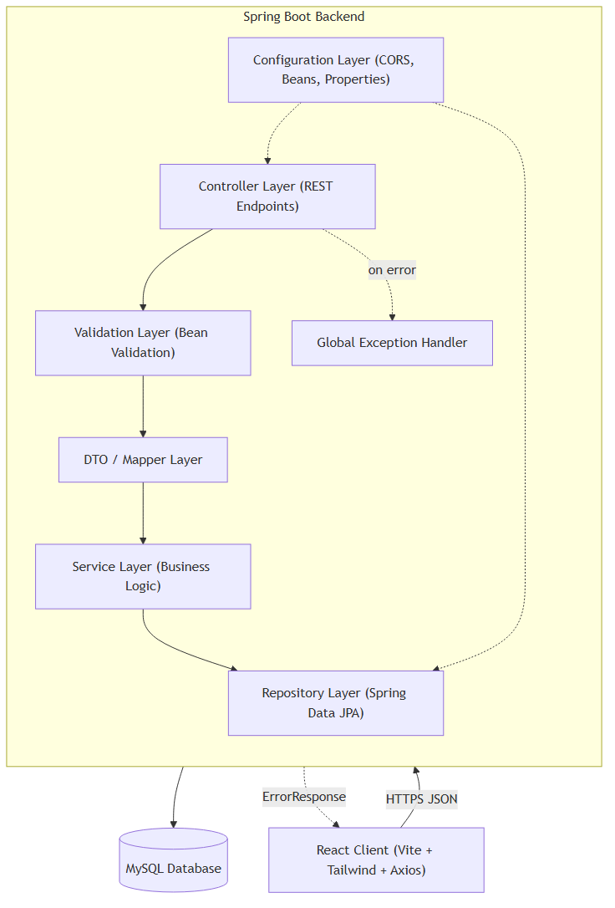
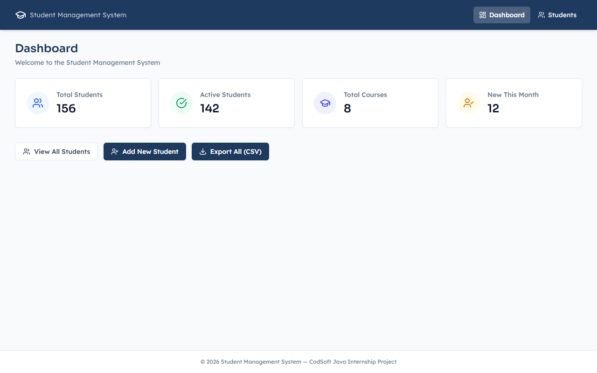
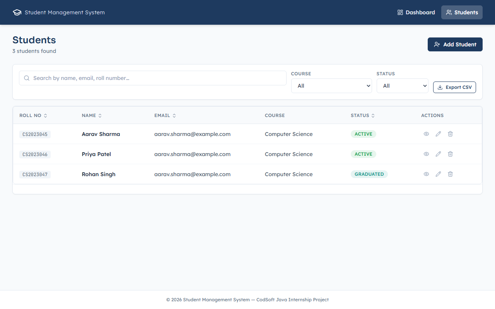
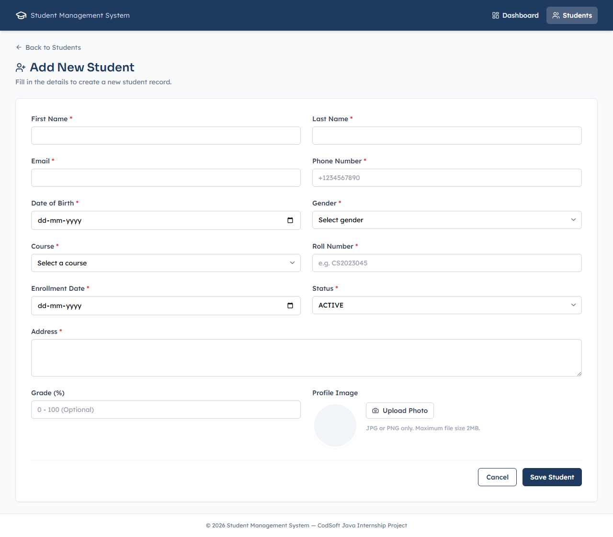
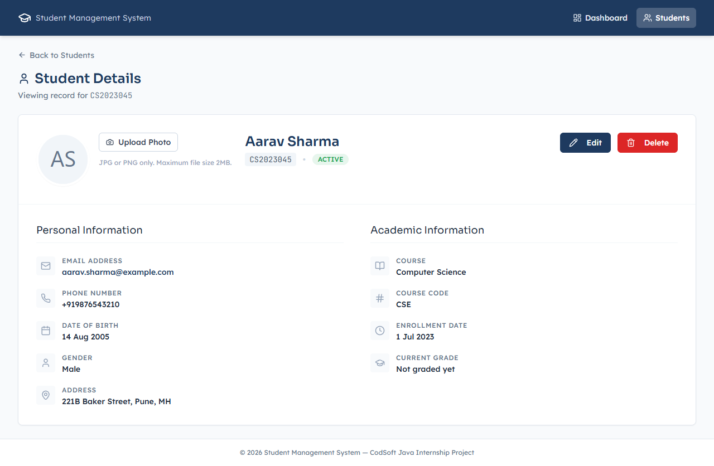

<div align="center">

# 🎓 Student Management System

**A full-stack CRUD application for managing student records — built with Spring Boot and React.**

[](https://www.oracle.com/java/)
[](https://spring.io/projects/spring-boot)
[](https://react.dev)
[](https://www.mysql.com)
[](LICENSE)

[Live Demo](https://student-management-system-aditya.vercel.app) · [Report Bug](https://github.com/AdiB1619/Codsoft/tree/main/Task%202%20-%20Student%20Management%20System/issues) · [Request Feature](https://github.com/AdiB1619/Codsoft/tree/main/Task%202%20-%20Student%20Management%20System/issues)

</div>

## 📖 Table of Contents

- [Overview](#overview)
- [Features](#features)
- [Architecture](#architecture)
- [Tech Stack](#tech-stack)
- [Screenshots](#screenshots)
- [Getting Started](#getting-started)
- [API Documentation](#api-documentation)
- [Project Structure](#project-structure)
- [Testing](#testing)
- [Roadmap](#roadmap)
- [Contributing](#contributing)
- [License](#license)
- [Author](#author)

## Overview

The Student Management System is a production-style CRUD application for managing student records — built as part of the CodSoft Java Development Virtual Internship, and engineered to portfolio/production standards: layered Spring Boot backend, React frontend, full validation and error handling, and a documented REST API.

## Features

- ✅ Full student CRUD with server-side validation
- ✅ Paginated, searchable, sortable, filterable student list
- ✅ Course-based relational data model
- ✅ Profile image upload
- ✅ Filtered CSV export
- ✅ Toast notifications, loading skeletons, confirmation dialogs
- ✅ Fully responsive, accessible UI
- ✅ Centralized exception handling with consistent error responses
- ✅ OpenAPI/Swagger docs + Postman collection

## Architecture



Layered architecture — Controller → Service → Repository — with DTOs at every API boundary. Full breakdown in [`docs/api-documentation.md`](docs/api-documentation.md).

## Tech Stack

| Layer | Technology |
|---|---|
| Backend | Java 21, Spring Boot, Spring MVC, Spring Data JPA, Hibernate |
| Frontend | React, Vite, Tailwind CSS, Axios |
| Database | MySQL |
| Tooling | Maven, Postman, Git |
| Deployment | Render / Railway (backend), Vercel (frontend) |

## Screenshots

| Dashboard | Student List |
|---|---|
|  |  |

| Add Student | Student Details |
|---|---|
|  |  |

## Getting Started

### Prerequisites

- Java 21+, Maven 3.9+
- Node.js 20+
- MySQL 8+

### 1. Clone the repository

```bash
git clone https://github.com/AdiB1619/codsoft_tasks.git
cd "codsoft_tasks/Task 2 - Student Management System"
```

### 2. Set up the database

```bash
mysql -u root -p < database/schema.sql
mysql -u root -p < database/seed-data.sql
```

### 3. Configure backend credentials

Create `backend/src/main/resources/application-dev.properties`:

```properties
spring.datasource.url=jdbc:mysql://localhost:3306/sms_db?useSSL=false&serverTimezone=UTC
spring.datasource.username=YOUR_MYSQL_USERNAME
spring.datasource.password=YOUR_MYSQL_PASSWORD
```

> This file is already in `.gitignore` — credentials will never be committed.

### 4. Run the backend

```bash
cd backend
mvn spring-boot:run
```

Backend runs at `http://localhost:8080`.

### 5. Run the frontend

```bash
cd frontend
npm install
npm run dev
```

Frontend runs at `http://localhost:5173`.

> The frontend is pre-configured to call `http://localhost:8080/api/v1`. To change this, copy `.env.example` to `.env` and set `VITE_API_BASE_URL`.

### Environment Variables

| Variable | Location | Example |
|---|---|---|
| `DB_USERNAME` | backend | `root` |
| `DB_PASSWORD` | backend | `root` |
| `APP_CORS_ALLOWED_ORIGINS` | backend | `http://localhost:5173` |
| `VITE_API_BASE_URL` | frontend | `http://localhost:8080/api/v1` |

## API Documentation

- **Swagger UI:** `http://localhost:8080/swagger-ui/index.html` (live, once backend is running)
- **Postman collection:** [`postman/`](postman/)
- **Full reference:** [`docs/api-documentation.md`](docs/api-documentation.md)

**Base URL:** `http://localhost:8080/api/v1`

| Method | Endpoint | Description | Status Codes |
|---|---|---|---|
| `POST` | `/students` | Create a student | 201, 400, 404, 409 |
| `GET` | `/students` | List students (paginated, filtered, searched) | 200, 400 |
| `GET` | `/students/{id}` | Get one student by ID | 200, 404 |
| `PUT` | `/students/{id}` | Full update of a student | 200, 400, 404, 409 |
| `PATCH` | `/students/{id}/status` | Update status only | 200, 400, 404 |
| `DELETE` | `/students/{id}` | Delete a student | 204, 404 |
| `POST` | `/students/{id}/profile-image` | Upload/replace profile image | 200, 400, 404 |
| `DELETE` | `/students/{id}/profile-image` | Remove profile image | 204, 404 |
| `GET` | `/students/export` | Export filtered list as CSV | 200, 400 |
| `GET` | `/students/stats` | Dashboard statistics | 200 |
| `GET` | `/courses` | List all courses | 200 |
| `POST` | `/courses` | Create a course | 201, 400, 409 |

## Project Structure

See [Section 5 of the Software Design Document](#5-folder-structure) for the complete annotated tree.

## Testing

```bash
# backend
cd backend && mvn test

# postman (requires newman)
newman run postman/Student-Management-System.postman_collection.json \
  -e postman/Student-Management-System.postman_environment.json
```

## Roadmap

See [Section 20 — Future Scope](#20-future-scope) of the design document for the full list. Highlights: authentication & RBAC, Dockerization, CI/CD, cloud file storage, analytics dashboard.

## Contributing

This is a personal internship/portfolio project, but suggestions are welcome — open an issue or a PR.

## License

Distributed under the MIT License. See [`LICENSE`](LICENSE) for details.

## Author

**Aditya Bachute** — [GitHub](https://github.com/AdiB1619)

## Acknowledgments

Built as part of the [CodSoft](https://www.codsoft.in) Java Development Virtual Internship.