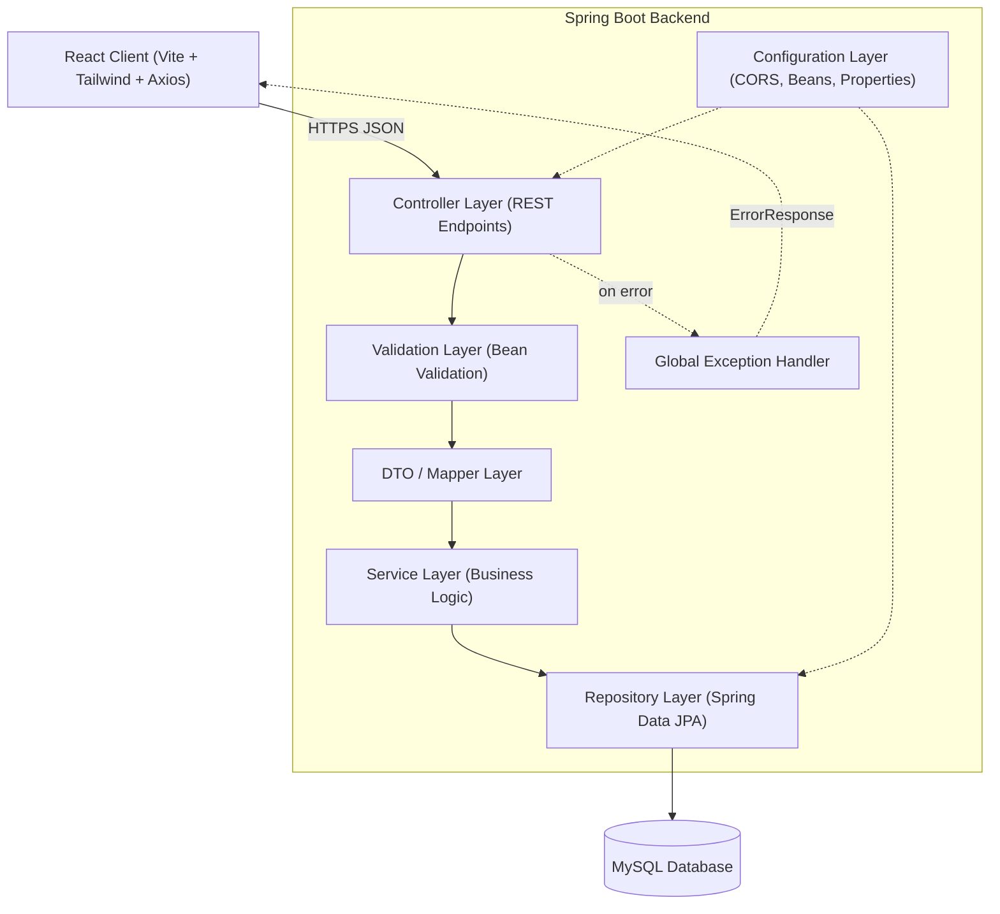
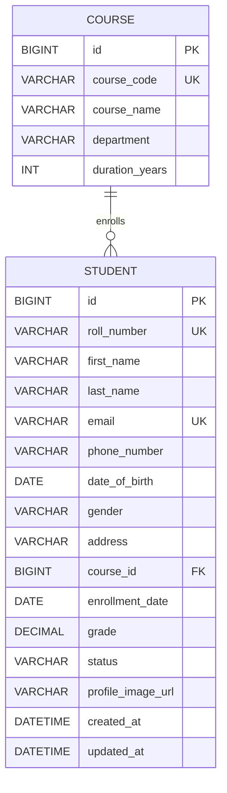
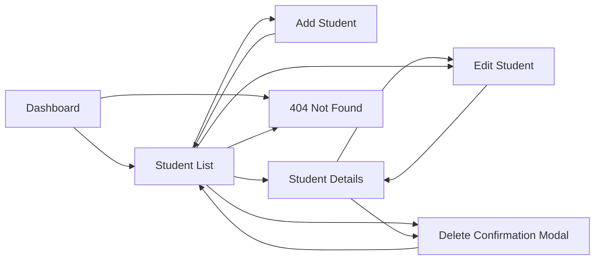
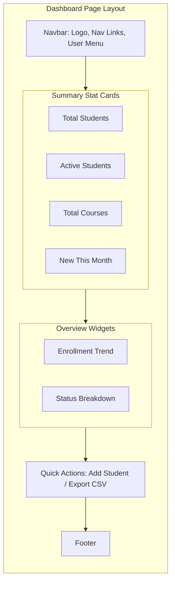
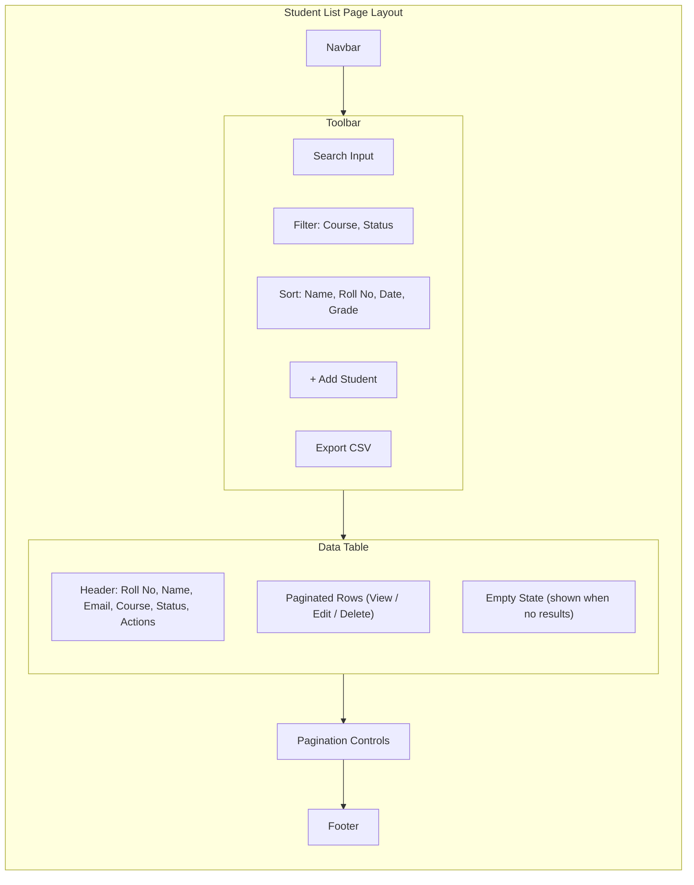
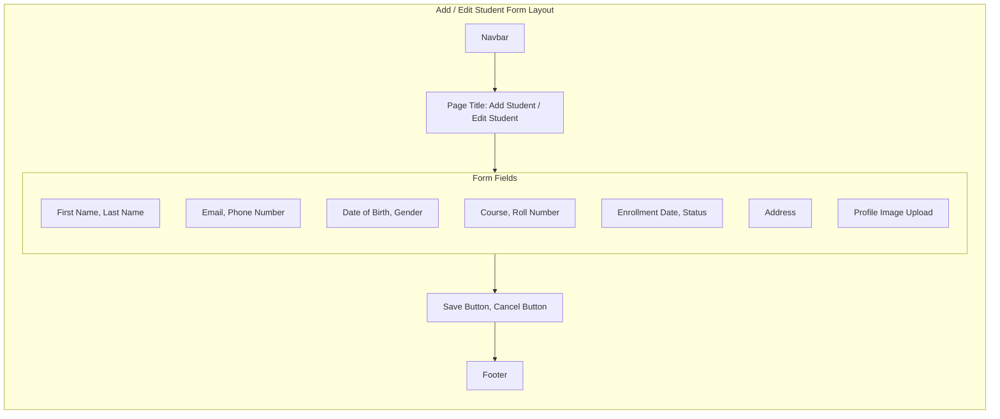
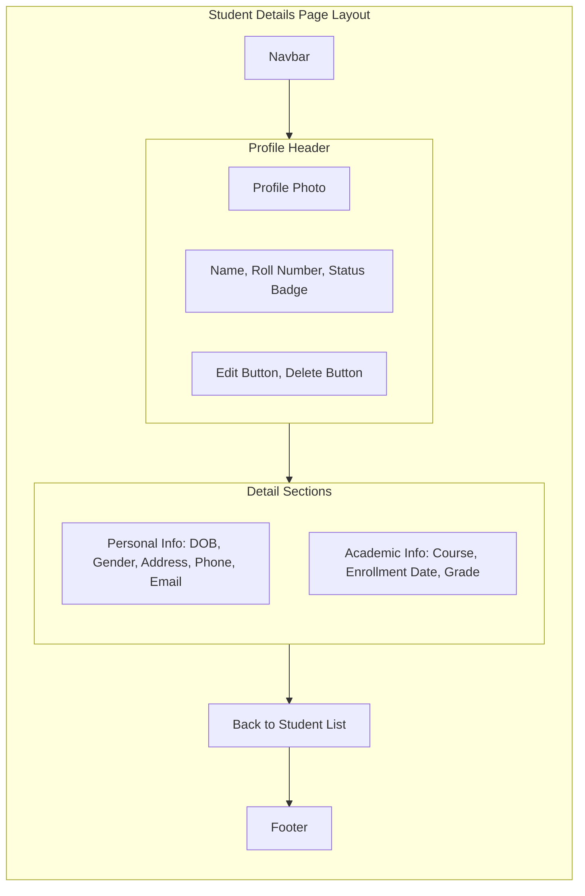
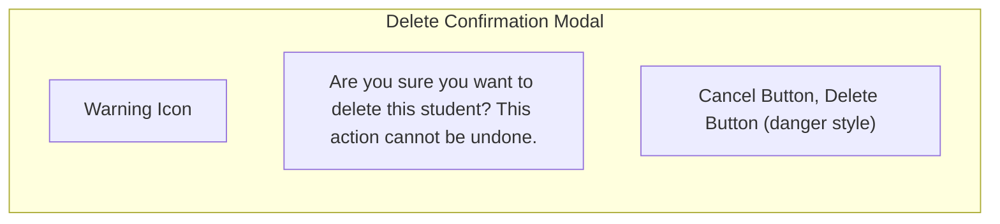
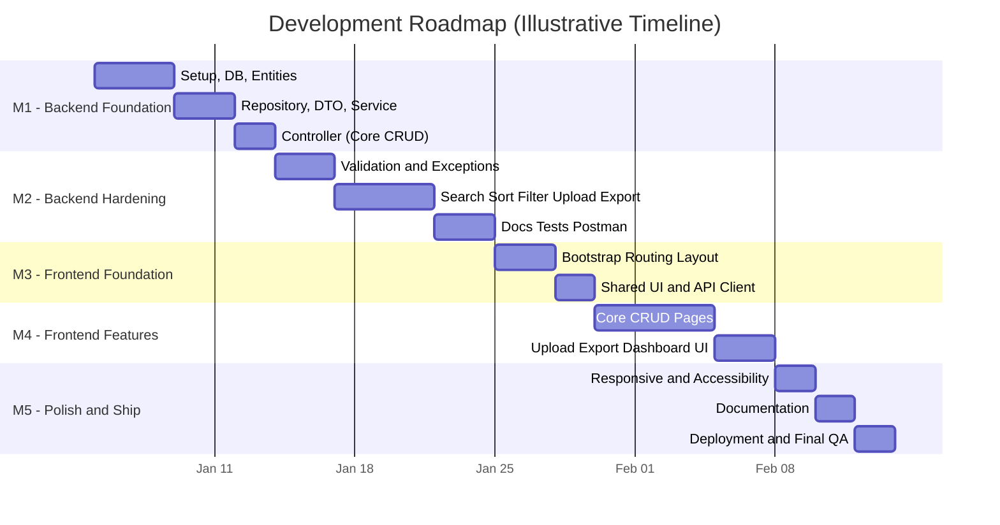

# 🎓 Student Management System
## Software Design & Development Blueprint (SDD)

**Project Type:** Java Full-Stack Web Application
**Prepared For:** CodSoft Java Development Virtual Internship
**Document Type:** Software Design Document (SDD) + AI-Agent Build Playbook
**Target Build Tool:** Google Antigravity (agentic IDE)
**Version:** 1.0.0 &nbsp;|&nbsp; **Status:** Ready for Development

---

## 📌 How to Use This Document

This is a complete **Software Design Document** for the Student Management System, written to work two ways:

1. **As a human reader** — Sections 1–20, 22, and 23 explain *what* is being built, *why*, and to what standard, so a mentor, recruiter, or future contributor can understand the system without reading a line of code.
2. **As an AI-agent build script** — Section 21 breaks the entire build into **34 small, sequential prompts** designed to be pasted **one at a time** into [Google Antigravity](https://antigravity.google)'s Agent Manager. Don't skip ahead or batch prompts together — each one is scoped to produce a reviewable **Task List → Implementation Plan → Walkthrough** artifact cycle before you move on.

> **Tip:** Read Sections 1–14 in full before running Prompt 1. The prompts in Section 21 assume that context already exists — that's *why* they can stay short and incremental.

---

## 🧭 Key Assumptions & Design Decisions

The internship brief only requires a simple CRUD project. To make it genuinely portfolio- and production-grade without over-engineering it, a few concrete decisions were made below. Adjust any of them before Prompt 1 if you'd prefer otherwise — the rest of the document is internally consistent with these choices.

| # | Decision | Reasoning |
|---|---|---|
| 1 | Added a second entity, **Course**, related to Student (many students → one course) | A single flat `students` table can't demonstrate relational design, foreign keys, joins, or referential integrity — all things Section 6 documents and recruiters look for |
| 2 | Backend package root is `com.codsoft.sms` | Short and professional — swap `codsoft` for your own identifier if you prefer |
| 3 | API is versioned under `/api/v1/...` | Costs nothing today, signals API design maturity |
| 4 | No authentication in v1.0 | Matches internship scope; full JWT + RBAC is explicitly planned in Section 20 so it's "on the roadmap," not "forgotten" |
| 5 | Profile images are stored on local disk in v1.0, behind a swappable storage utility | Keeps the internship build simple while Section 20 documents the one-class change needed to move to S3/Cloudinary later |
| 6 | Deployment targets: Render or Railway (backend) + Vercel (frontend) | All three were listed as optional in the brief; exact steps are kept general since free-tier terms on these platforms change — check current provider docs before deploying |

---

## Table of Contents

1. [Executive Summary](#1-executive-summary)
2. [Functional Requirements](#2-functional-requirements)
3. [Non-Functional Requirements](#3-non-functional-requirements)
4. [Software Architecture](#4-software-architecture)
5. [Folder Structure](#5-folder-structure)
6. [Database Design](#6-database-design)
7. [REST API Design](#7-rest-api-design)
8. [Frontend Design](#8-frontend-design)
9. [UI/UX Guidelines](#9-uiux-guidelines)
10. [Validation Rules](#10-validation-rules)
11. [Exception Handling Strategy](#11-exception-handling-strategy)
12. [Security](#12-security)
13. [Development Roadmap](#13-development-roadmap)
14. [Git Strategy](#14-git-strategy)
15. [Professional GitHub README Outline](#15-professional-github-readme-outline)
16. [Demo Video Plan](#16-demo-video-plan)
17. [LinkedIn Post Outline](#17-linkedin-post-outline)
18. [Resume Bullet Points](#18-resume-bullet-points)
19. [Testing Strategy](#19-testing-strategy)
20. [Future Scope](#20-future-scope)
21. [Google Antigravity Development Prompts](#21-google-antigravity-development-prompts)
22. [AI Coding Rules](#22-ai-coding-rules)
23. [Project Evaluation Checklist](#23-project-evaluation-checklist)

---

## 1. Executive Summary

### 1.1 Purpose

Every academic institution — from a small coaching center to a university department — runs on student records: who's enrolled, in what course, since when, and how they're performing. When that data lives in scattered spreadsheets, it becomes slow to search, easy to corrupt with duplicate or malformed entries, and impossible to share safely with more than one person at a time. The **Student Management System** replaces that spreadsheet with a proper full-stack web application: a single source of truth for student records, accessible through a clean UI, backed by a validated, auditable REST API.

### 1.2 Why This Project Is Valuable

Beyond satisfying the CodSoft Java Development Virtual Internship brief, this project is deliberately scoped to double as a genuine portfolio piece:

- It exercises the **full stack** end to end — schema design, ORM mapping, REST API design, validation, error handling, and a React UI consuming that API — rather than a backend-only or frontend-only exercise.
- Every architectural decision in this document (DTOs, service layer, global exception handling, layered validation) mirrors patterns used in real production Spring Boot codebases, not internship shortcuts that would need to be unlearned later.
- The project is scoped to be **finished**, not perpetually "in progress" — Section 13's roadmap and Section 21's prompts define a clear, bounded path to a tagged v1.0.0 release.

### 1.3 Software Engineering Concepts Demonstrated

| Concept | Where It Shows Up |
|---|---|
| Layered Architecture | Section 4 — Controller → Service → Repository separation |
| Separation of Concerns | DTOs isolate the API contract from the persistence model (Sections 4, 6) |
| RESTful API Design | Resource-oriented URLs, correct HTTP verbs and status codes (Section 7) |
| Defensive Programming | Bean Validation + centralized exception handling (Sections 10–11) |
| Relational Database Design | Normalized schema, keys, indexes, constraints (Section 6) |
| Clean Code & SOLID | Enforced throughout the build via Section 22's standing AI coding rules |
| State Management & Data Fetching | React hooks, an Axios service layer, loading/error/empty states (Section 8) |
| API-First Documentation | OpenAPI/Swagger + a Postman collection (Sections 7, 15) |
| Test-Driven Confidence | Unit and integration tests per layer (Section 19) |
| DevOps Fundamentals | Git workflow, environment-based config, deployment (Sections 12, 14) |

---

## 2. Functional Requirements

Requirements are grouped by capability and prioritized with MoSCoW (**M**ust, **S**hould, **C**ould, **W**on't-for-v1).

### 2.1 Core CRUD

| ID | Requirement | Description | Priority |
|---|---|---|---|
| FR-01 | Create student | Add a new student record with full profile data | Must |
| FR-02 | View student list | Retrieve a paginated list of all students | Must |
| FR-03 | View student details | Retrieve a single student's full profile | Must |
| FR-04 | Update student | Edit an existing student's details | Must |
| FR-05 | Delete student | Permanently remove a student record, behind a confirmation step | Must |
| FR-06 | Manage courses | Maintain a small list of courses students can enroll in | Must |

### 2.2 Data Discovery

| ID | Requirement | Description | Priority |
|---|---|---|---|
| FR-07 | Search | Free-text search across name, roll number, and email | Must |
| FR-08 | Sort | Sort the student list by name, roll number, enrollment date, or grade — ascending/descending | Must |
| FR-09 | Filter | Filter by course and by status (Active / Inactive / Graduated / Suspended) | Must |
| FR-10 | Pagination | Server-side pagination with configurable page size | Must |
| FR-11 | Combined queries | Search, filter, sort, and pagination all compose together | Should |

### 2.3 User Experience

| ID | Requirement | Description | Priority |
|---|---|---|---|
| FR-12 | Validation feedback | Inline, field-level validation errors on every form | Must |
| FR-13 | Toast notifications | Success / error / warning / info toasts for every mutating action | Must |
| FR-14 | Loading indicators | Skeleton or spinner states while data is in flight | Must |
| FR-15 | Confirmation dialogs | Destructive actions (delete) require explicit confirmation | Must |
| FR-16 | Empty states | Friendly messaging when a list or search has no results | Should |
| FR-17 | Responsive UI | Usable on mobile, tablet, and desktop breakpoints | Must |
| FR-18 | 404 handling | Unknown routes and missing records degrade gracefully | Should |

### 2.4 Media & Data Portability

| ID | Requirement | Description | Priority |
|---|---|---|---|
| FR-19 | Profile image upload | Upload / replace / remove a student's profile photo (JPG/PNG, ≤2MB) | Should |
| FR-20 | CSV export | Export the current, filtered student list as a downloadable CSV | Should |

### 2.5 Explicitly Out of Scope for v1.0 (see Section 20)

| ID | Requirement | Description |
|---|---|---|
| FR-21 | Authentication & RBAC | Login, roles, protected routes |
| FR-22 | Bulk import | CSV/Excel bulk student import |
| FR-23 | Email notifications | Enrollment / status-change emails |
| FR-24 | Analytics dashboard | Trend charts, grade distributions |
| FR-25 | Audit logs | Who changed what, and when |

---

## 3. Non-Functional Requirements

| Category | Requirement | Target / Approach |
|---|---|---|
| **Performance** | API responsiveness | Typical CRUD endpoints respond in <300ms locally; list endpoints are always paginated, never returning unbounded result sets |
| **Performance** | Query efficiency | Indexes on every searched/sorted/filtered column (Section 6); no N+1 queries — use `@EntityGraph` or `JOIN FETCH` when a Course needs to load with its Students |
| **Security** | Input handling | Every write passes Bean Validation before it reaches the Service layer (Section 10) |
| **Security** | Injection prevention | 100% parameterized JPA/Hibernate queries — zero string-concatenated SQL (Section 12) |
| **Security** | Transport | CORS restricted to known frontend origins; HTTPS enforced in any deployed environment |
| **Scalability** | Statelessness | The backend holds no session state, so it can scale horizontally behind a load balancer if ever needed |
| **Scalability** | Connection pooling | HikariCP (Spring Boot's default), tuned via `application.properties` |
| **Maintainability** | Modularity | Strict layer boundaries (Section 4); no business logic outside the Service layer |
| **Maintainability** | SOLID compliance | Enforced throughout Section 21's build prompts and Section 22's standing rules |
| **Readability** | Naming & style | Standard Java/JS naming conventions; Javadoc on every public service method |
| **Code Quality** | Static analysis | Recommended: Checkstyle (backend), ESLint + Prettier (frontend) |
| **Responsiveness (UI)** | Breakpoints | Mobile-first Tailwind breakpoints — `sm` 640px, `md` 768px, `lg` 1024px, `xl` 1280px (Section 9) |
| **Accessibility** | Standard | WCAG 2.1 AA — keyboard operability, visible focus states, sufficient color contrast, labeled form controls |


---

## 4. Software Architecture

### 4.1 Overview

The backend follows a strict **layered architecture** (a variant of MVC adapted for a REST API, where the "View" is a JSON representation rather than a server-rendered page). Each layer has exactly one job and only ever talks to the layer directly below it:

```
React Client → Controller Layer → Service Layer → Repository Layer → MySQL
```

Cross-cutting concerns — validation, exception handling, configuration — sit beside this chain rather than inside it, so they apply uniformly without any single layer needing to know about them.

### 4.2 Layer Responsibilities

| Layer | Responsibility | Key Classes / Annotations |
|---|---|---|
| **Controller** | Parse HTTP requests, delegate to Service, shape the HTTP response | `@RestController`, `@RequestMapping`, `@Valid` |
| **Service** | All business logic: orchestration, uniqueness checks, transaction boundaries | `@Service`, `@Transactional` |
| **Repository** | Data access only — no business rules | `JpaRepository`, `JpaSpecificationExecutor` |
| **Entity** | Persistence mapping to MySQL tables | `@Entity`, `@Table`, `@Column`, `@ManyToOne` |
| **DTO / Mapper** | Decouple the public API contract from the persistence model | Plain Java objects + mapper classes |
| **Exception** | Central translation of failures into consistent HTTP error responses | `@RestControllerAdvice`, custom exception types |
| **Configuration** | CORS, beans, environment-specific properties, OpenAPI setup | `@Configuration`, `application*.properties` |
| **Validation** | Field-level and cross-field input rules | Bean Validation annotations, custom `@Constraint`s |
| **Utility** | Stateless helpers (file storage, CSV export) shared across services | Plain Java utility classes |

### 4.3 Key Design Patterns

| Pattern | Why It's Used Here |
|---|---|
| **Repository Pattern** | Spring Data JPA repositories abstract SQL away from the Service layer entirely |
| **DTO Pattern** | Entities never cross the API boundary — prevents over-exposure and lets the API contract evolve independently of the schema |
| **Service Layer Pattern** | All business rules live in one place, independently testable with mocked repositories |
| **Dependency Injection** | Constructor injection throughout — no field `@Autowired`, everything stays unit-testable |
| **Global Exception Handler** | One `@RestControllerAdvice` instead of try/catch scattered across every controller method |
| **Specification Pattern** | Dynamic, composable search/filter/sort queries (Section 7.2) without an explosion of `findByXAndYAndZ` repository methods |

### 4.4 Architecture Diagram



**Note:** solid lines are the primary request path; dashed lines are cross-cutting or error-path flow.

---

## 5. Folder Structure

### 5.1 Repository Root

```
student-management-system/
├── backend/                     # Spring Boot application
├── frontend/                    # React application
├── database/                    # SQL schema and seed scripts
│   ├── schema.sql
│   └── seed-data.sql
├── postman/                     # API testing collection
│   ├── Student-Management-System.postman_collection.json
│   └── Student-Management-System.postman_environment.json
├── docs/                        # Diagrams, screenshots, API docs
│   ├── architecture-diagram.png
│   ├── er-diagram.png
│   ├── api-documentation.md
│   └── screenshots/
├── .gitignore
├── README.md
└── LICENSE
```

### 5.2 Backend (`backend/`)

```
backend/
├── src/
│   ├── main/
│   │   ├── java/com/codsoft/sms/
│   │   │   ├── SmsApplication.java
│   │   │   ├── config/
│   │   │   │   ├── CorsConfig.java
│   │   │   │   ├── OpenApiConfig.java
│   │   │   │   └── JpaAuditingConfig.java
│   │   │   ├── controller/
│   │   │   │   ├── StudentController.java
│   │   │   │   └── CourseController.java
│   │   │   ├── service/
│   │   │   │   ├── StudentService.java
│   │   │   │   ├── CourseService.java
│   │   │   │   └── impl/
│   │   │   │       ├── StudentServiceImpl.java
│   │   │   │       └── CourseServiceImpl.java
│   │   │   ├── repository/
│   │   │   │   ├── StudentRepository.java
│   │   │   │   └── CourseRepository.java
│   │   │   ├── entity/
│   │   │   │   ├── Student.java
│   │   │   │   ├── Course.java
│   │   │   │   └── enums/
│   │   │   │       ├── Gender.java
│   │   │   │       └── StudentStatus.java
│   │   │   ├── dto/
│   │   │   │   ├── request/
│   │   │   │   │   ├── StudentRequestDTO.java
│   │   │   │   │   └── CourseRequestDTO.java
│   │   │   │   └── response/
│   │   │   │       ├── StudentResponseDTO.java
│   │   │   │       ├── CourseResponseDTO.java
│   │   │   │       ├── ApiResponse.java
│   │   │   │       ├── PagedResponse.java
│   │   │   │       └── ErrorResponse.java
│   │   │   ├── mapper/
│   │   │   │   ├── StudentMapper.java
│   │   │   │   └── CourseMapper.java
│   │   │   ├── exception/
│   │   │   │   ├── GlobalExceptionHandler.java
│   │   │   │   ├── ResourceNotFoundException.java
│   │   │   │   ├── DuplicateResourceException.java
│   │   │   │   ├── InvalidFileException.java
│   │   │   │   └── FileStorageException.java
│   │   │   ├── validation/
│   │   │   │   ├── MinAge.java
│   │   │   │   └── MinAgeValidator.java
│   │   │   └── util/
│   │   │       ├── FileStorageUtil.java
│   │   │       ├── CsvExportUtil.java
│   │   │       └── AppConstants.java
│   │   └── resources/
│   │       ├── application.properties
│   │       ├── application-dev.properties
│   │       ├── application-prod.properties
│   │       └── static/uploads/          # local profile-image storage (v1.0)
│   └── test/
│       └── java/com/codsoft/sms/
│           ├── controller/
│           ├── service/
│           └── repository/
└── pom.xml
```

### 5.3 Frontend (`frontend/`)

```
frontend/
├── public/
│   └── favicon.svg
├── src/
│   ├── main.jsx
│   ├── App.jsx
│   ├── api/
│   │   ├── axiosInstance.js
│   │   ├── studentApi.js
│   │   └── courseApi.js
│   ├── components/
│   │   ├── layout/
│   │   │   ├── Navbar.jsx
│   │   │   ├── Footer.jsx
│   │   │   └── AppLayout.jsx
│   │   ├── students/
│   │   │   ├── StudentTable.jsx
│   │   │   ├── StudentForm.jsx
│   │   │   ├── StudentCard.jsx
│   │   │   ├── DeleteConfirmModal.jsx
│   │   │   └── ProfileImageUpload.jsx
│   │   └── common/
│   │       ├── Button.jsx
│   │       ├── Badge.jsx
│   │       ├── Toast.jsx
│   │       ├── Loader.jsx
│   │       ├── Pagination.jsx
│   │       ├── SearchBar.jsx
│   │       ├── FilterDropdown.jsx
│   │       ├── EmptyState.jsx
│   │       └── ConfirmModal.jsx
│   ├── pages/
│   │   ├── Dashboard.jsx
│   │   ├── StudentListPage.jsx
│   │   ├── AddStudentPage.jsx
│   │   ├── EditStudentPage.jsx
│   │   ├── StudentDetailsPage.jsx
│   │   └── NotFoundPage.jsx
│   ├── hooks/
│   │   ├── useStudents.js
│   │   ├── useDebounce.js
│   │   └── useToast.js
│   ├── context/
│   │   └── ToastContext.jsx
│   ├── utils/
│   │   ├── validators.js
│   │   ├── formatters.js
│   │   └── constants.js
│   └── styles/
│       └── index.css
├── index.html
├── package.json
├── vite.config.js
├── tailwind.config.js
├── postcss.config.js
└── .env.example
```

> `docs/screenshots/` is intentionally empty until Prompt 33 (Documentation Pass). Recommended captures: Dashboard, Student List (populated + empty state), Add/Edit Form, Student Details, Delete Confirmation, and one mobile-width screenshot.

---

## 6. Database Design

### 6.1 `students` Table

| Column | Type | Constraints | Notes |
|---|---|---|---|
| id | BIGINT | PK, AUTO_INCREMENT | |
| roll_number | VARCHAR(20) | NOT NULL, UNIQUE | e.g. `CS2023045` |
| first_name | VARCHAR(50) | NOT NULL | |
| last_name | VARCHAR(50) | NOT NULL | |
| email | VARCHAR(100) | NOT NULL, UNIQUE | |
| phone_number | VARCHAR(15) | NOT NULL | |
| date_of_birth | DATE | NOT NULL | |
| gender | VARCHAR(10) | NOT NULL | Stored as STRING enum: `MALE`, `FEMALE`, `OTHER` |
| address | VARCHAR(200) | NOT NULL | |
| course_id | BIGINT | NOT NULL, FK → `courses.id` | |
| enrollment_date | DATE | NOT NULL | |
| grade | DECIMAL(5,2) | NULL | Percentage, 0–100; null until first recorded |
| status | VARCHAR(15) | NOT NULL, DEFAULT `'ACTIVE'` | `ACTIVE`, `INACTIVE`, `GRADUATED`, `SUSPENDED` |
| profile_image_url | VARCHAR(255) | NULL | |
| created_at | DATETIME | NOT NULL | Set once, via JPA auditing |
| updated_at | DATETIME | NOT NULL | Updated on every write, via JPA auditing |

### 6.2 `courses` Table

| Column | Type | Constraints | Notes |
|---|---|---|---|
| id | BIGINT | PK, AUTO_INCREMENT | |
| course_code | VARCHAR(15) | NOT NULL, UNIQUE | e.g. `CSE` |
| course_name | VARCHAR(100) | NOT NULL | e.g. `Computer Science` |
| department | VARCHAR(100) | NOT NULL | |
| duration_years | INT | NOT NULL | |

### 6.3 ER Diagram



### 6.4 Relationships

- **Course → Student** is one-to-many: one course has zero or more enrolled students; every student belongs to exactly one course (`course_id` is `NOT NULL`).
- The relationship is enforced with `ON DELETE RESTRICT` — a course with enrolled students cannot be deleted, preventing orphaned student records. Deleting a course is a rare, deliberate admin action; the API should require moving or removing its students first.

### 6.5 Indexes

| Index | Column(s) | Purpose |
|---|---|---|
| `idx_students_email` (unique) | `email` | Enforce uniqueness, speed up duplicate checks |
| `idx_students_roll_number` (unique) | `roll_number` | Enforce uniqueness, speed up lookups |
| `idx_students_course_id` | `course_id` | Speed up the FK join and course-based filtering |
| `idx_students_status` | `status` | Speed up status-based filtering |
| `idx_students_enrollment_date` | `enrollment_date` | Speed up sort-by-enrollment-date |
| `idx_courses_course_code` (unique) | `course_code` | Enforce uniqueness |

### 6.6 Constraints

- `NOT NULL` on every required field listed above.
- `UNIQUE` on `email`, `roll_number`, `course_code`.
- `FOREIGN KEY (course_id) REFERENCES courses(id)` with `ON DELETE RESTRICT`.
- Application-level equivalents of a `CHECK` constraint (enforced in the Service layer, since not all MySQL engines honor `CHECK` consistently): `grade` between `0` and `100`; `status` and `gender` restricted to their enum value sets.

### 6.7 Future Scalability

| Concern | Approach |
|---|---|
| Soft delete | Add an `is_deleted` flag (or repurpose `status`) instead of hard-deleting, so records can be restored (Section 20) |
| Audit trail | Add `created_by` / `updated_by` columns once authentication exists |
| Large datasets | Partition `students` by `enrollment_date` year if the table grows past several million rows |
| Schema versioning | Introduce Flyway or Liquibase migrations instead of a single static `schema.sql` once the schema needs to evolve post-launch |
| Read scaling | Add a read replica and route list/search queries to it if read traffic ever outgrows a single MySQL instance |

---

## 7. REST API Design

### 7.1 Conventions

- **Base path:** `/api/v1`
- **Format:** JSON request/response bodies; `multipart/form-data` for the image upload endpoint only.
- **Response envelope** — every non-export response is wrapped for consistency:

```json
{
  "success": true,
  "message": "Human-readable summary",
  "data": { "...": "..." },
  "timestamp": "2026-07-07T10:15:30Z"
}
```

- **Paginated data** additionally shapes `data` as:

```json
{
  "content": [ { "...": "..." } ],
  "pageNumber": 0,
  "pageSize": 10,
  "totalElements": 57,
  "totalPages": 6,
  "last": false
}
```

- **Errors** always return the shape defined in Section 11.2 — never a bare stack trace or an ad hoc shape.

### 7.2 Endpoint Summary

| # | Method | Endpoint | Purpose |
|---|---|---|---|
| 1 | POST | `/api/v1/students` | Create a student |
| 2 | GET | `/api/v1/students` | List students (paginated, sorted, filtered, searched) |
| 3 | GET | `/api/v1/students/{id}` | Get one student |
| 4 | PUT | `/api/v1/students/{id}` | Update a student |
| 5 | PATCH | `/api/v1/students/{id}/status` | Change only a student's status |
| 6 | DELETE | `/api/v1/students/{id}` | Delete a student |
| 7 | POST | `/api/v1/students/{id}/profile-image` | Upload/replace profile image |
| 8 | DELETE | `/api/v1/students/{id}/profile-image` | Remove profile image |
| 9 | GET | `/api/v1/students/export` | Export filtered students as CSV |
| 10 | GET | `/api/v1/courses` | List all courses |
| 11 | POST | `/api/v1/courses` | Create a course |

### 7.3 `POST /api/v1/students` — Create Student

**Purpose:** Create a new student record.

**Request Body:**
```json
{
  "firstName": "Aarav",
  "lastName": "Sharma",
  "email": "aarav.sharma@example.com",
  "phoneNumber": "+919876543210",
  "dateOfBirth": "2005-08-14",
  "gender": "MALE",
  "address": "221B Baker Street, Pune, MH",
  "rollNumber": "CS2023045",
  "courseId": 3,
  "enrollmentDate": "2023-07-01",
  "status": "ACTIVE"
}
```

**Success Response — `201 Created`:**
```json
{
  "success": true,
  "message": "Student created successfully",
  "data": {
    "id": 101,
    "firstName": "Aarav",
    "lastName": "Sharma",
    "email": "aarav.sharma@example.com",
    "rollNumber": "CS2023045",
    "course": { "id": 3, "courseCode": "CSE", "courseName": "Computer Science" },
    "status": "ACTIVE",
    "profileImageUrl": null,
    "createdAt": "2026-07-07T10:15:30Z"
  },
  "timestamp": "2026-07-07T10:15:30Z"
}
```

**Status Codes:**

| Code | Meaning |
|---|---|
| 201 | Created successfully |
| 400 | Validation failure (missing/malformed field) |
| 404 | `courseId` does not reference an existing course |
| 409 | `email` or `rollNumber` already exists |
| 500 | Unexpected server error |

**Validation:** full field-level rules in Section 10.

**Possible Errors:** missing required field → 400 · invalid email format → 400 · duplicate email → 409 · duplicate roll number → 409 · non-existent `courseId` → 404.

### 7.4 `GET /api/v1/students` — List Students

**Purpose:** Retrieve a paginated, sortable, filterable, searchable list of students.

**Query Parameters:**

| Param | Type | Default | Notes |
|---|---|---|---|
| `page` | int | `0` | Zero-indexed |
| `size` | int | `10` | Max `100` |
| `sortBy` | string | `id` | One of: `firstName`, `lastName`, `rollNumber`, `enrollmentDate`, `grade` |
| `sortDir` | string | `asc` | `asc` or `desc` |
| `search` | string | — | Matches partial, case-insensitive `firstName`/`lastName`/`email`/`rollNumber` |
| `courseId` | long | — | Filter to one course |
| `status` | string | — | One of the status enum values |

**Success Response — `200 OK`:** the paginated envelope from Section 7.1; `data.content` is an array of student summaries.

**Status Codes:** `200` · `400` (invalid `sortBy` or `status` value) · `500`.

**Possible Errors:** unrecognized `sortBy` → 400 (never silently falls back, and the raw string is never passed straight into a query) · invalid `status` value → 400.

### 7.5 `GET /api/v1/students/{id}` — Get Student by ID

**Purpose:** Retrieve one student's full profile.

**Status Codes:** `200` · `404` (no student with that id) · `500`.

### 7.6 `PUT /api/v1/students/{id}` — Update Student

**Purpose:** Full update of an existing student.

**Request Body:** same shape as Create (Section 7.3).

**Status Codes:** `200` · `400` · `404` (student or referenced course not found) · `409` (email/rollNumber collides with a *different* student) · `500`.

### 7.7 `PATCH /api/v1/students/{id}/status` — Update Status Only

**Purpose:** Quickly transition a student's status (e.g. `ACTIVE` → `GRADUATED`) without resubmitting the whole form.

**Request Body:**
```json
{ "status": "GRADUATED" }
```

**Status Codes:** `200` · `400` (invalid enum value) · `404` · `500`.

### 7.8 `DELETE /api/v1/students/{id}` — Delete Student

**Purpose:** Permanently remove a student record.

**Status Codes:** `204` (no body) · `404` · `500`.

### 7.9 `POST /api/v1/students/{id}/profile-image` — Upload Profile Image

**Purpose:** Upload or replace a student's profile photo.

**Request Body:** `multipart/form-data`, field name `file`.

**Success Response — `200 OK`:**
```json
{
  "success": true,
  "message": "Profile image uploaded successfully",
  "data": { "profileImageUrl": "/uploads/students/8f14e-avatar.jpg" },
  "timestamp": "2026-07-07T10:20:00Z"
}
```

**Status Codes:** `200` · `400` (wrong type or over 2MB) · `404` (student not found) · `500`.

**Validation:** JPG/PNG only · ≤2MB · the server checks the actual file signature, not just the client-supplied `Content-Type`.

### 7.10 `DELETE /api/v1/students/{id}/profile-image` — Remove Profile Image

**Purpose:** Delete the stored image and revert `profileImageUrl` to `null`.

**Status Codes:** `204` · `404` · `500`.

### 7.11 `GET /api/v1/students/export` — Export CSV

**Purpose:** Export the current filtered/searched/sorted student list as a downloadable CSV — same query params as Section 7.4, minus pagination (exports the full matching set, capped at 10,000 rows as a safety limit).

**Response:** `Content-Type: text/csv`, `Content-Disposition: attachment; filename="students-export-2026-07-07.csv"`, streamed body.

**Status Codes:** `200` · `400` · `500`.

### 7.12 `GET /api/v1/courses` — List Courses

**Purpose:** Retrieve all courses, primarily to populate dropdowns and filters.

**Status Codes:** `200` · `500`.

### 7.13 `POST /api/v1/courses` — Create Course

**Purpose:** Add a new course. This is an administrative utility endpoint — full Course CRUD (update/delete) is future scope (Section 20).

**Request Body:**
```json
{
  "courseCode": "CSE",
  "courseName": "Computer Science",
  "department": "Engineering",
  "durationYears": 4
}
```

**Status Codes:** `201` · `400` · `409` (duplicate `courseCode`) · `500`.

> **Recommended addition:** expose Spring Boot Actuator's `GET /actuator/health` for uptime checks once the app is deployed (Section 13, Prompt 34).

---

## 8. Frontend Design

### 8.1 Page Inventory

| Page | Route | Purpose | Key States |
|---|---|---|---|
| Dashboard | `/` | At-a-glance overview: totals, quick actions | Loading, populated |
| Student List | `/students` | Browse, search, sort, filter, paginate students | Loading, populated, empty, error |
| Add Student | `/students/new` | Create a new student | Idle, validating, submitting, error |
| Edit Student | `/students/:id/edit` | Update an existing student | Loading, idle, validating, submitting, error, not-found |
| Student Details | `/students/:id` | Read-only full profile view | Loading, populated, not-found |
| 404 Not Found | `*` | Catch-all for unknown routes | Static |

Every page shares a persistent **Navbar** and **Footer** via `AppLayout` (Section 5.3), and every mutating action produces a **Toast** (success/error/warning/info).

### 8.2 Site Navigation Flow



### 8.3 Dashboard — Wireframe



### 8.4 Student List — Wireframe



### 8.5 Add / Edit Student Form — Wireframe



### 8.6 Student Details — Wireframe



### 8.7 Delete Confirmation — Wireframe



### 8.8 Loading, Empty & Error States

| State | Where | Treatment |
|---|---|---|
| Loading | Any data fetch | Skeleton rows in tables, spinner + label elsewhere — never a blank white screen |
| Empty | No students match the current search/filter | `EmptyState` component: icon, one-line explanation, a clear next action (e.g. "Clear filters" or "Add your first student") |
| Error | A request fails | Toast with a plain-language message; page-level errors (e.g. student not found) render an in-page state, not a crash |

---

## 9. UI/UX Guidelines

### 9.1 Design Direction

The palette and type system below are grounded in the subject — a **student records office**, not a generic SaaS dashboard. The reference points are transcripts, ID cards, and gradebooks: navy paired with a restrained academic gold reads as institutional and trustworthy without tipping into a literal university-crest cliché. This is a deliberate choice, not a default — avoid substituting a generic blue-and-purple gradient theme, since that communicates nothing about the domain.

### 9.2 Color Palette

| Token | Hex | Usage |
|---|---|---|
| `primary` | `#1E3A5F` (deep navy) | Primary buttons, navbar, headings, active nav state |
| `primary-hover` | `#2C4F7C` | Hover/focus state for primary elements |
| `accent` | `#0D9488` (teal) | Links, secondary buttons, active filters, chart accents |
| `accent-gold` | `#C9A227` | Sparing use only — logo mark, achievement/status highlights |
| `success` | `#16A34A` | Success toasts, `ACTIVE` status badge |
| `warning` | `#D97706` | Warning toasts, `SUSPENDED` status badge |
| `danger` | `#DC2626` | Destructive actions, error toasts, validation errors |
| `neutral-50`…`neutral-900` | Tailwind `slate` scale | Backgrounds, borders, body text |

`INACTIVE`/`GRADUATED` status badges use `neutral-500` and `accent` respectively, keeping the semantic colors (success/warning/danger) reserved for states that need attention.

### 9.3 Typography

| Role | Typeface | Rationale |
|---|---|---|
| Headings | **Sora** | A geometric sans with enough personality to feel intentional, without being as overused as Poppins/Inter for headings |
| Body | **Lexend** | Designed and tested to improve reading proficiency — a genuine, thematically fitting choice for an academic-records product, not just a default |
| Data / Monospace | **JetBrains Mono** | Roll numbers, IDs, and course codes — anything meant to be scanned or copied exactly |

Type scale: `text-xs` (12px, captions) → `text-sm` (14px, table/body) → `text-base` (16px, form inputs) → `text-xl`/`text-2xl` (page titles) → `text-3xl` (dashboard stat numbers). Headings use `font-semibold`; body text stays `font-normal` for readability.

### 9.4 Spacing System

Tailwind's default 4px base scale is used throughout (`p-1` = 4px … `p-8` = 32px) for consistency and to avoid one-off pixel values. Page-level padding: `p-4` on mobile, `p-8` on desktop. Card/section gaps: `gap-4`–`gap-6`.

### 9.5 Responsive Breakpoints

| Breakpoint | Width | Layout Behavior |
|---|---|---|
| Default (mobile) | <640px | Single column; table becomes stacked cards; toolbar stacks vertically |
| `sm` | ≥640px | Two-column form fields begin |
| `md` | ≥768px | Table view replaces stacked cards; sidebar-style filters |
| `lg` | ≥1024px | Full toolbar in one row; dashboard stat cards in a 4-column grid |
| `xl` | ≥1280px | Max content width caps at `1280px`, centered, to avoid overly long line lengths |

### 9.6 Accessibility Checklist

- [ ] All interactive elements are real semantic elements (`<button>`, `<a>`) — never a `<div onClick>`
- [ ] Every form input has an associated `<label>` (not just a placeholder)
- [ ] Color contrast meets WCAG AA (4.5:1 for body text) — verified for navy-on-white and white-on-navy combinations specifically
- [ ] Visible focus rings on every interactive element (never `outline: none` without a replacement)
- [ ] Modals trap focus and close on `Escape`
- [ ] Toasts are announced to screen readers via `aria-live="polite"`
- [ ] Images (profile photos) have meaningful `alt` text; decorative icons use `aria-hidden`

### 9.7 Icons

**lucide-react** is used as a single, consistent icon set throughout. Icons are always paired with a text label except in dense contexts like table row actions, where a `title` attribute substitutes for a visible label.

### 9.8 Motion

Motion is used sparingly and purposefully, not as ambient decoration:

- Page/section transitions: none (instant) — an academic records tool should feel immediate, not performative
- Toasts: slide-in/fade, ~200ms
- Modal open/close: fade + slight scale, ~150ms
- Hover states: color/shadow transition, ~150ms ease
- `prefers-reduced-motion` is respected — all non-essential transitions are disabled when set

### 9.9 Component Hierarchy

| Level | Examples |
|---|---|
| **Atoms** | `Button`, `Badge`, `Input` (native `<input>` + Tailwind), `Loader` |
| **Molecules** | `SearchBar` (Input + icon), `FilterDropdown`, `Pagination`, `EmptyState` |
| **Organisms** | `StudentTable`, `StudentForm`, `Navbar`, `ConfirmModal` |
| **Templates** | `AppLayout` (Navbar + content slot + Footer) |
| **Pages** | `Dashboard`, `StudentListPage`, `AddStudentPage`, `EditStudentPage`, `StudentDetailsPage`, `NotFoundPage` |

---

## 10. Validation Rules

Applied identically on the frontend (`utils/validators.js`, for instant feedback) and the backend (Bean Validation — the source of truth, since the frontend can never be trusted alone).

| Field | Type | Required | Rule | Backend Annotation | Pattern | Error Message |
|---|---|---|---|---|---|---|
| firstName | String | Yes | 2–50 chars, letters/spaces/hyphens/apostrophes | `@NotBlank @Size(min=2,max=50) @Pattern` | `^[A-Za-z\s'-]{2,50}$` | "First name must be 2–50 characters and contain only letters" |
| lastName | String | Yes | Same as firstName | Same | Same | "Last name must be 2–50 characters and contain only letters" |
| email | String | Yes | Valid email format, unique | `@NotBlank @Email` | RFC-5322-lite | "Enter a valid email address" |
| phoneNumber | String | Yes | 10–13 digits, optional leading `+` | `@NotBlank @Pattern` | `^\+?[0-9]{10,13}$` | "Enter a valid phone number" |
| dateOfBirth | Date | Yes | Must be in the past; student must be ≥10 years old | `@NotNull @Past` + custom `@MinAge(10)` | — | "Student must be at least 10 years old" |
| gender | Enum | Yes | One of `MALE`, `FEMALE`, `OTHER` | `@NotNull` | — | "Select a gender" |
| address | String | Yes | 5–200 chars | `@NotBlank @Size(min=5,max=200)` | — | "Address must be between 5 and 200 characters" |
| rollNumber | String | Yes, unique | 2–4 letters + 3–6 digits | `@NotBlank @Pattern` | `^[A-Z]{2,4}[0-9]{3,6}$` | "Roll number format is invalid" (uniqueness checked separately → 409) |
| courseId | Long | Yes | Must reference an existing course | `@NotNull` | — | "Select a valid course" |
| enrollmentDate | Date | Yes | Cannot be in the future | `@NotNull @PastOrPresent` | — | "Enrollment date cannot be in the future" |
| grade | Decimal | No | 0–100 if present | `@DecimalMin("0") @DecimalMax("100")` | — | "Grade must be between 0 and 100" |
| status | Enum | Yes (defaults `ACTIVE`) | One of the 4 status values | `@NotNull` | — | "Invalid status value" |
| profileImage | File | No | JPG/PNG only, ≤2MB | Validated in `FileStorageUtil`, not Bean Validation | — | "Only JPG or PNG images up to 2MB are allowed" |

---

## 11. Exception Handling Strategy

### 11.1 Custom Exceptions

| Exception | HTTP Status | Thrown When |
|---|---|---|
| `ResourceNotFoundException` | 404 Not Found | A student/course id (or a `courseId` reference) doesn't exist |
| `DuplicateResourceException` | 409 Conflict | `email`, `rollNumber`, or `courseCode` already exists |
| `MethodArgumentNotValidException` *(built-in)* | 400 Bad Request | A `@Valid` request body fails Bean Validation |
| `HttpMessageNotReadableException` *(built-in)* | 400 Bad Request | Malformed/unparseable JSON body |
| `InvalidFileException` | 400 Bad Request | Uploaded file is the wrong type or too large |
| `FileStorageException` | 500 Internal Server Error | The server fails to persist an uploaded file |
| `DataIntegrityViolationException` *(built-in)* | 409 Conflict | A DB-level constraint is violated despite passing application checks (safety net) |
| `Exception` *(catch-all)* | 500 Internal Server Error | Anything unanticipated — logged server-side, generic message returned to the client |

All of these are intercepted in one place: `GlobalExceptionHandler`, annotated `@RestControllerAdvice`, with one `@ExceptionHandler` method per type. **Controllers and Services never build an error `ResponseEntity` themselves** — they only throw semantic exceptions.

### 11.2 Standard Error Response Shape

```json
{
  "success": false,
  "status": 404,
  "error": "Not Found",
  "message": "Student not found with id: 25",
  "path": "/api/v1/students/25",
  "timestamp": "2026-07-07T10:22:11Z",
  "fieldErrors": []
}
```

For validation failures, `fieldErrors` is populated:

```json
{
  "success": false,
  "status": 400,
  "error": "Bad Request",
  "message": "Validation failed",
  "path": "/api/v1/students",
  "timestamp": "2026-07-07T10:22:11Z",
  "fieldErrors": [
    { "field": "email", "message": "Enter a valid email address" },
    { "field": "rollNumber", "message": "Roll number format is invalid" }
  ]
}
```

### 11.3 Ground Rules

- No stack trace, SQL fragment, or internal class name ever reaches the client — log those server-side with a real logger (`Slf4j`), never `System.out.println`.
- Every new endpoint added during development must have its failure modes mapped to one of the exceptions above before the prompt implementing it is considered complete (enforced in Section 22).

---

## 12. Security

| Concern | Approach |
|---|---|
| **CORS** | `CorsConfig` allow-lists exact frontend origins from a property (`app.cors.allowed-origins`) — never a wildcard `*` in any profile resembling production |
| **Input Sanitization** | All input passes Bean Validation before touching the Service layer; free-text fields (address) are trimmed and length-capped |
| **SQL Injection Prevention** | 100% JPA/Hibernate parameterized queries via repositories and the `Specification` API — no native queries built with string concatenation, ever |
| **XSS Prevention** | React escapes rendered text by default; `dangerouslySetInnerHTML` is never used; a `Content-Security-Policy` header is added at the deployment/reverse-proxy layer |
| **File Upload Security** | Content-type *and* file-signature checked server-side, size capped at 2MB, filenames are server-generated (UUID-based) rather than trusting client input |
| **Error Responses** | Never leak internals (Section 11) — a consistent, minimal error shape reduces the attack surface for information disclosure |
| **Dependency Hygiene** | Keep Spring Boot, React, and all dependencies on current minor versions; review `mvn dependency:tree` / `npm audit` periodically |
| **Future: Authentication** | Spring Security + JWT, `BCrypt` password hashing, short-lived access tokens + refresh tokens, role-based `@PreAuthorize` on endpoints — fully scoped in Section 20 |

---

## 13. Development Roadmap

Each milestone maps to a contiguous block of prompts in Section 21 and is independently buildable and demoable — you can stop after any milestone and have a working (if incomplete) application.

| # | Milestone | Goal | Maps to Prompts |
|---|---|---|---|
| M1 | Backend Foundation | Project scaffolding, DB connection, entities, repositories, DTOs, service layer, core CRUD API | 1–8 |
| M2 | Backend Hardening | Validation, global exception handling, pagination/sort/search/filter, uploads, export, docs, tests | 9–17 |
| M3 | Frontend Foundation | React/Vite/Tailwind bootstrap, routing, shared components, API client | 18–21 |
| M4 | Frontend Features | All CRUD pages, search/sort/filter UI, uploads, export, dashboard | 22–30 |
| M5 | Polish & Ship | 404 handling, responsive/accessibility pass, docs, deployment, v1.0.0 tag | 31–34 |

### 13.1 Estimated Timeline



> Durations are illustrative planning estimates for a solo internship developer working part-time, not commitments — Section 21 breaks each block down into daily-sized prompts regardless of the calendar time you actually have.

---

## 14. Git Strategy

### 14.1 Branching Model

A simplified trunk-based model, appropriate for a solo project:

- `main` — always deployable; every merge corresponds to a completed prompt or milestone
- `feature/<short-name>` — one branch per prompt (or small group of related prompts), merged back into `main` via PR — even solo, PRs create a reviewable history

### 14.2 Branch Naming

| Pattern | Example |
|---|---|
| `feature/<scope>` | `feature/student-entity`, `feature/csv-export` |
| `fix/<scope>` | `fix/pagination-sort-bug` |
| `docs/<scope>` | `docs/readme-finalize` |
| `chore/<scope>` | `chore/deploy-config` |

### 14.3 Commit Message Convention

[Conventional Commits](https://www.conventionalcommits.org/): `type(scope): short summary`, imperative mood, present tense.

| Type | Use For |
|---|---|
| `feat` | A new feature |
| `fix` | A bug fix |
| `docs` | Documentation only |
| `style` | Formatting, no logic change |
| `refactor` | Code change that neither fixes a bug nor adds a feature |
| `test` | Adding or correcting tests |
| `chore` | Tooling, config, dependencies, release tagging |

### 14.4 Sample Commit History

A realistic log across the whole build (matches Section 21's per-prompt commit messages, in order):

```
chore: initialize repository structure and gitignore
feat(backend): initialize spring boot project skeleton
feat(db): add mysql schema, seed data, and datasource configuration
feat(entity): add student and course jpa entities with enums
feat(repository): add student and course repositories
feat(dto): add request/response dtos and entity mappers
feat(service): implement student and course service layer
feat(controller): add core crud rest endpoints for students and courses
feat(validation): add bean validation rules to request dtos
feat(exception): implement global exception handler and custom exceptions
feat(api): add pagination and sorting to student listing endpoint
feat(api): add search and filter support to student listing endpoint
feat(upload): implement profile image upload and removal
feat(export): implement filtered csv export endpoint
feat(config): configure cors policy and openapi documentation
test(backend): complete unit and integration test coverage
docs(postman): add complete api testing collection
feat(frontend): bootstrap vite react app with tailwind
feat(routing): add app routing, layout, navbar and footer
feat(ui): add shared component library and toast/modal infrastructure
feat(api-client): add axios instance and resource-based api modules
feat(pages): implement student list page with pagination
feat(ui): integrate search sort and filter into student list
feat(pages): implement add student form with validation
feat(pages): implement edit student form
feat(pages): implement student details page
feat(ui): implement delete confirmation flow
feat(upload): implement profile image upload ui
feat(export): implement csv export button and download handling
feat(pages): implement dashboard with summary statistics
feat(routing): finalize 404 page and graceful not-found handling
fix(ui): responsive and accessibility improvements across all pages
docs: finalize readme, api docs, diagrams and screenshots
chore(release): deploy application and tag v1.0.0
```

### 14.5 Pull Request Strategy

Even solo, treat every feature branch as a PR into `main`:

- [ ] PR description states the goal (copied from the Section 21 prompt's **Goal**)
- [ ] PR links back to the milestone/prompt number
- [ ] The prompt's Acceptance Criteria checklist is pasted into the PR and checked off
- [ ] CI (once configured — Section 20) is green before merge
- [ ] Squash-merge into `main` to keep history readable

---

## 15. Professional GitHub README Outline

A README is the first (and often only) thing a recruiter or reviewer reads. Below is a ready-to-use template, pre-filled with this project's real details. Replace every `<placeholder>`, swap in real screenshots once Prompt 33 is complete, and it's ready to publish as `README.md`.

`````markdown
<div align="center">

# 🎓 Student Management System

**A full-stack CRUD application for managing student records — built with Spring Boot and React.**

[](https://www.oracle.com/java/)
[](https://spring.io/projects/spring-boot)
[](https://react.dev)
[](https://www.mysql.com)
[](LICENSE)

[Live Demo](<your-deployed-url>) · [Report Bug](<your-repo-url>/issues) · [Request Feature](<your-repo-url>/issues)

</div>

## 📖 Table of Contents

- [Overview](#overview)
- [Features](#features)
- [Architecture](#architecture)
- [Tech Stack](#tech-stack)
- [Screenshots](#screenshots)
- [Getting Started](#getting-started)
- [API Documentation](#api-documentation)
- [Project Structure](#project-structure)
- [Testing](#testing)
- [Roadmap](#roadmap)
- [Contributing](#contributing)
- [License](#license)
- [Author](#author)

## Overview

The Student Management System is a production-style CRUD application for managing student records — built as part of the CodSoft Java Development Virtual Internship, and engineered to portfolio/production standards: layered Spring Boot backend, React frontend, full validation and error handling, and a documented REST API.

## Features

- ✅ Full student CRUD with server-side validation
- ✅ Paginated, searchable, sortable, filterable student list
- ✅ Course-based relational data model
- ✅ Profile image upload
- ✅ Filtered CSV export
- ✅ Toast notifications, loading skeletons, confirmation dialogs
- ✅ Fully responsive, accessible UI
- ✅ Centralized exception handling with consistent error responses
- ✅ OpenAPI/Swagger docs + Postman collection

## Architecture


Layered architecture — Controller → Service → Repository — with DTOs at every API boundary. Full breakdown in [`docs/api-documentation.md`](docs/api-documentation.md).

## Tech Stack

| Layer | Technology |
|---|---|
| Backend | Java 21, Spring Boot, Spring MVC, Spring Data JPA, Hibernate |
| Frontend | React, Vite, Tailwind CSS, Axios |
| Database | MySQL |
| Tooling | Maven, Postman, Git |
| Deployment | Render / Railway (backend), Vercel (frontend) |

## Screenshots

| Dashboard | Student List |
|---|---|
|  |  |

| Add Student | Student Details |
|---|---|
|  |  |

## Getting Started

### Prerequisites

- Java 21+, Maven 3.9+
- Node.js 20+
- MySQL 8+

### 1. Clone the repository

```bash
git clone <your-repo-url>
cd student-management-system
```

### 2. Set up the database

```bash
mysql -u root -p < database/schema.sql
mysql -u root -p < database/seed-data.sql
```

### 3. Run the backend

```bash
cd backend
# set DB credentials via environment variables or application-dev.properties
mvn spring-boot:run
```

Backend runs at `http://localhost:8080`.

### 4. Run the frontend

```bash
cd frontend
cp .env.example .env
# set VITE_API_BASE_URL in .env
npm install
npm run dev
```

Frontend runs at `http://localhost:5173`.

### Environment Variables

| Variable | Location | Example |
|---|---|---|
| `DB_USERNAME` | backend | `root` |
| `DB_PASSWORD` | backend | `<your-password>` |
| `APP_CORS_ALLOWED_ORIGINS` | backend | `http://localhost:5173` |
| `VITE_API_BASE_URL` | frontend | `http://localhost:8080/api/v1` |

## API Documentation

- Interactive Swagger UI: `http://localhost:8080/swagger-ui.html` (once running locally)
- Postman collection: [`postman/Student-Management-System.postman_collection.json`](postman/Student-Management-System.postman_collection.json)
- Full endpoint reference: [`docs/api-documentation.md`](docs/api-documentation.md)

## Project Structure

See [Section 5 of the Software Design Document](#5-folder-structure) for the complete annotated tree.

## Testing

```bash
# backend
cd backend && mvn test

# postman (requires newman)
newman run postman/Student-Management-System.postman_collection.json \
  -e postman/Student-Management-System.postman_environment.json
```

## Roadmap

See [Section 20 — Future Scope](#20-future-scope) of the design document for the full list. Highlights: authentication & RBAC, Dockerization, CI/CD, cloud file storage, analytics dashboard.

## Contributing

This is a personal internship/portfolio project, but suggestions are welcome — open an issue or a PR.

## License

Distributed under the MIT License. See [`LICENSE`](LICENSE) for details.

## Author

**<Your Name>** — [GitHub](<your-github-url>) · [LinkedIn](<your-linkedin-url>)

## Acknowledgments

Built as part of the [CodSoft](https://www.codsoft.in) Java Development Virtual Internship.
`````

---

## 16. Demo Video Plan

**Target length:** 2.5–3.5 minutes. Record the backend running locally with Postman/Swagger open in one pass, then the frontend in a second pass, and edit together — much easier than one unbroken take.

| # | Segment | Duration | Screen | Talking Points |
|---|---|---|---|---|
| 1 | Hook + Intro | 0:00–0:15 | Dashboard, camera/voiceover | "Hi, I'm \<name\> — this is a Student Management System I built for my CodSoft Java internship, using Spring Boot and React." |
| 2 | Problem & Approach | 0:15–0:30 | Slide or voiceover only | Why spreadsheets fall short; one sentence on the layered architecture |
| 3 | Tech Stack | 0:30–0:40 | README tech stack table or a simple slide | Name the stack in one breath: "Java 21, Spring Boot, MySQL, React, Tailwind" |
| 4 | Live Demo — Browse & Search | 0:40–1:10 | Student List page | Search, sort, filter, pagination in action |
| 5 | Live Demo — Create | 1:10–1:35 | Add Student form | Fill the form, show one validation error, then submit successfully — toast appears |
| 6 | Live Demo — Edit & Delete | 1:35–2:00 | Edit form, delete confirmation | Update a field, save; delete a record, show the confirmation modal |
| 7 | Live Demo — Upload & Export | 2:00–2:25 | Profile image upload, CSV export | Upload a photo, download and briefly show the exported CSV |
| 8 | Architecture Glimpse | 2:25–2:50 | `docs/architecture-diagram.png`, one backend file (e.g. `GlobalExceptionHandler`) | "Every request flows Controller → Service → Repository, with centralized validation and error handling" |
| 9 | Responsive Check | 2:50–3:05 | Browser dev-tools mobile view | Resize to show the table collapsing into cards |
| 10 | Closing | 3:05–3:20 | GitHub repo page | "Code, README, and API docs are all linked below — thanks for watching!" |

---

## 17. LinkedIn Post Outline

**Structure:** Hook → what it does → tech stack → what you learned → visuals → link → hashtags → call to action.

**Ready-to-edit sample post:**

> 🎓 Just shipped a full-stack **Student Management System** — my project for the CodSoft Java Development Virtual Internship!
>
> Instead of a bare-minimum CRUD exercise, I built it end-to-end the way I'd want to see it in production:
>
> ✅ Spring Boot REST API with a proper layered architecture (Controller → Service → Repository)
> ✅ DTOs + a global exception handler so every error response is consistent
> ✅ React + Tailwind frontend with search, sort, filter, and pagination
> ✅ Full validation on both frontend and backend
> ✅ Documented with Swagger + a complete Postman collection
>
> **Stack:** Java 21 · Spring Boot · Spring Data JPA · MySQL · React · Vite · Tailwind CSS
>
> The biggest thing I took away: how much a clean DTO/service-layer boundary simplifies everything downstream — testing, error handling, even just reasoning about the code six files later.
>
> 🔗 Code + README: `<your-repo-link>`
> 🎥 Demo video: `<your-video-link>`
>
> #Java #SpringBoot #React #WebDevelopment #FullStackDevelopment #CodSoft #SoftwareEngineering

---

## 18. Resume Bullet Points

> **A note on honesty:** every bracketed `[metric]` below is a placeholder. Fill it in only with a number you actually measured (real response times from Postman, a real test-coverage percentage, a real endpoint count). A fabricated metric on a resume is a real risk once a recruiter asks you to explain it — an honest, smaller number always holds up better in an interview.

- Architected and built a full-stack Student Management System using **Java 21, Spring Boot, and React**, implementing a layered architecture (Controller–Service–Repository) with **11 REST endpoints** covering CRUD, search, filtering, sorting, and pagination
- Designed a normalized **MySQL** schema with indexed, constrained tables and a one-to-many relational model, reducing measured average list-query response time to under **[X]ms**
- Implemented centralized exception handling and Bean Validation across the entire API, mapping **8 distinct failure modes** to consistent, structured error responses
- Built a responsive **React + Tailwind CSS** UI with debounced search, sortable tables, toast notifications, and skeleton loading states, tested across mobile, tablet, and desktop breakpoints
- Implemented server-side file upload validation and a filtered CSV export feature, handling multipart requests and streamed responses in Spring Boot
- Documented the complete REST API with OpenAPI/Swagger and a Postman collection, and wrote **[X]** unit and integration tests covering **[X]%** of the service layer
- Followed a structured Git workflow with Conventional Commits and PR-based development, shipping a tagged **v1.0.0** release deployed to Render/Railway and Vercel

---

## 19. Testing Strategy

### 19.1 Layers

| Type | Scope | Tooling |
|---|---|---|
| Unit | Service layer business logic, in isolation | JUnit 5 + Mockito (mocked repositories) |
| Repository | Query correctness against a real DB dialect | `@DataJpaTest` (H2 or a Testcontainers MySQL) |
| Integration | Full HTTP request → response cycle | `@SpringBootTest` + `MockMvc` |
| Manual | End-to-end UI flows a script can't easily assert on | Structured checklist, run before each milestone tag |
| API (Postman) | Contract verification against a running server | The Section 21 Postman collection + Newman |

### 19.2 Sample Test Case Matrix

| Test ID | Module | Scenario | Expected Result | Type |
|---|---|---|---|---|
| TC-01 | Student | Create with valid data | 201, student returned with generated id | Integration |
| TC-02 | Student | Create with duplicate email | 409 Conflict | Integration |
| TC-03 | Student | Create with missing `firstName` | 400, `fieldErrors` includes `firstName` | Unit |
| TC-04 | Student | Get by valid id | 200, correct student | Integration |
| TC-05 | Student | Get by non-existent id | 404 | Integration |
| TC-06 | Student | Update with valid data | 200, fields reflect the update | Integration |
| TC-07 | Student | Delete existing student | 204 | Integration |
| TC-08 | Student | Delete non-existent id | 404 | Integration |
| TC-09 | Pagination | Page 2, size 5 | Correct subset, correct `totalPages` | Integration |
| TC-10 | Search | Partial name match | Only matching students returned | Integration |
| TC-11 | Filter | `status=ACTIVE` | Only active students returned | Integration |
| TC-12 | Sort | `sortBy=enrollmentDate&sortDir=desc` | Correctly ordered list | Integration |
| TC-13 | Validation | Invalid email format | 400 | Unit |
| TC-14 | Validation | Future date of birth | 400 | Unit |
| TC-15 | Upload | Valid JPG under 2MB | 200, URL returned | Integration |
| TC-16 | Upload | Oversized file | 400 | Integration |
| TC-17 | Upload | Unsupported file type | 400 | Integration |
| TC-18 | Export | CSV with active filters | Rows match the filtered set | Manual |
| TC-19 | Security | SQL-injection-style search string | Treated as a literal string; no injection | Integration |
| TC-20 | Frontend | Submit form with empty required fields | Inline errors shown; no API call made | Manual |
| TC-21 | Frontend | Network failure during fetch | Toast error shown | Manual |
| TC-22 | Responsive | 375px viewport | Layout adapts, no horizontal scroll | Manual |

### 19.3 Edge Cases to Cover

- Concurrent create requests with the same email/roll number (race condition)
- Unicode/special characters in name fields (`José`, `O'Brien`, `李雷`)
- Strings at exactly the max-length boundary, and one character over it
- Double-clicking delete on an already-deleted record
- Sorting/filtering on an unrecognized field name
- Requesting a page number beyond the last page
- Leap-year date of birth (Feb 29)
- Attempting to delete a course that still has enrolled students
- A very large CSV export (thousands of rows) — confirm it streams rather than loading fully into memory
- A script-tag payload (`<script>`) in a free-text field — confirm React escapes it on render and the backend stores it safely

---

## 20. Future Scope

| Feature | Description | Complexity | Value |
|---|---|---|---|
| Authentication (Spring Security + JWT) | Secure login for staff/admin users | Medium | High |
| Role-Based Access Control | Admin / Teacher / Viewer roles with different permissions | Medium | High |
| Cloud Storage for Images | Swap local disk for S3/Cloudinary behind the existing `FileStorageUtil` interface | Low–Medium | Medium |
| Dockerization | `Dockerfile` for backend + frontend, `docker-compose.yml` including MySQL | Medium | High |
| CI/CD Pipeline | GitHub Actions: build, test, lint, deploy on push to `main` | Medium | High |
| Email Notifications | Enrollment confirmation / status-change emails via `JavaMailSender` | Low | Medium |
| Analytics Dashboard | Enrollment trend and grade-distribution charts | Medium | Medium |
| Audit Logging | Track who created/updated/deleted each record, and when | Medium | High |
| Soft Delete | Restorable deletes via an `is_deleted` flag instead of hard deletes | Low | Medium |
| Bulk Import | CSV/Excel bulk student import with a validation report | Medium | Medium |
| Dark Mode | Theme toggle | Low | Low–Medium |
| Internationalization (i18n) | Multi-language UI | Medium | Low |
| Caching (Redis) | Cache the course list and dashboard stats | Medium | Medium |
| Rate Limiting | Prevent API abuse | Low | Medium |
| Live Updates (WebSocket) | Real-time dashboard refresh on data change | High | Low–Medium |

---

## 21. Google Antigravity Development Prompts

This is the most important section of the document — everything above exists to make these prompts short.

### 21.1 How to Run This Section

- Antigravity organizes work through an **Agent Manager** — the Mission Control surface where you spawn and monitor agent tasks (toggle between it and the Editor view with `Cmd/Ctrl+E`).
- Each prompt below is meant to become **one Agent Manager task**. Paste the whole block in as the task. The agent will respond with a **Task List** artifact (its plan) before touching any files — read it. If it looks right, let it proceed to the **Implementation Plan**, then the code itself, then a **Walkthrough** (screenshots or a browser recording proving it actually works) before you move to the next prompt.
- **Keep review-gated mode on** for this build — don't set your artifact review policy to "Always Proceed," and be deliberate about Turbo Mode / auto-continue. This is a learning project; reading each Task List and Implementation Plan is where the learning happens, not a step to automate away.
- **Before Prompt 1**, create an `AGENTS.md` file at the repository root containing the contents of Section 22 (AI Coding Rules). Antigravity — like most current agentic coding tools — reads this automatically on project open and applies it to every task. If you use Antigravity exclusively, a `GEMINI.md` works the same way; if you might also use Cursor or Claude Code on this repo later, keep the shared rules in `AGENTS.md` and any Antigravity-only overrides in `GEMINI.md` (Antigravity reads both, and `GEMINI.md` wins on conflicts).
- **Also add one explicit rule pointing at Section 9** of this document. Antigravity defaults toward its own "premium, dynamic" visual style (glassmorphism, heavy animation) unless told otherwise — which would fight the intentional, restrained design direction in Section 9. A one-line rule ("Follow the color palette, typography, and motion guidelines in the project's design document exactly — no glassmorphism, no gradients outside the defined palette") heads this off.
- Exact rule-file locations and the Agent Manager menu path have shifted between Antigravity versions. If what you see doesn't match the above, open **Agent Manager → ⋯ (top right) → Additional options → Customizations** to find the current Rules/Workflows tabs.

### 21.2 Prompt Index

| # | Phase | Prompt |
|---|---|---|
| 1 | Backend Foundation | Monorepo & Git Scaffolding |
| 2 | Backend Foundation | Spring Boot Project Initialization |
| 3 | Backend Foundation | MySQL Database Configuration & Connection |
| 4 | Backend Foundation | Student & Course JPA Entities |
| 5 | Backend Foundation | Repository Layer |
| 6 | Backend Foundation | DTOs & Mapper Layer |
| 7 | Backend Foundation | Service Layer (Business Logic) |
| 8 | Backend Foundation | REST Controller — Core CRUD |
| 9 | Backend Hardening | Bean Validation Layer |
| 10 | Backend Hardening | Global Exception Handling |
| 11 | Backend Hardening | Pagination & Sorting |
| 12 | Backend Hardening | Search & Filtering |
| 13 | Backend Hardening | Profile Image Upload |
| 14 | Backend Hardening | CSV Export |
| 15 | Backend Hardening | CORS Configuration & OpenAPI/Swagger Docs |
| 16 | Backend Hardening | Backend Automated Tests |
| 17 | Backend Hardening | Postman Collection |
| 18 | Frontend Foundation | React + Vite + Tailwind Bootstrap |
| 19 | Frontend Foundation | Routing, Layout, Navbar & Footer |
| 20 | Frontend Foundation | Shared UI Component Library |
| 21 | Frontend Foundation | Axios API Client Layer |
| 22 | Frontend Features | Student List Page (Table + Pagination) |
| 23 | Frontend Features | Search, Sort & Filter UI |
| 24 | Frontend Features | Add Student Form |
| 25 | Frontend Features | Edit Student Form |
| 26 | Frontend Features | Student Details Page |
| 27 | Frontend Features | Delete Confirmation Flow |
| 28 | Frontend Features | Profile Image Upload UI |
| 29 | Frontend Features | CSV Export UI |
| 30 | Frontend Features | Dashboard Page |
| 31 | Polish & Ship | 404 Page & Route Guarding |
| 32 | Polish & Ship | Responsive & Accessibility Pass |
| 33 | Polish & Ship | Documentation Pass |
| 34 | Polish & Ship | Deployment & Final Release (v1.0.0) |

### 21.3 Phase A + B — Backend (Prompts 1–17)

#### Prompt 1 — Monorepo & Git Scaffolding

**Goal:** Create the root repository structure and initialize version control — no backend or frontend code yet.

**Files to Create:** `.gitignore`, `README.md` (placeholder), `LICENSE` (MIT), `docs/.gitkeep`, `database/.gitkeep`, `postman/.gitkeep`, `backend/.gitkeep`, `frontend/.gitkeep`.

**Files to Modify:** None.

**Coding Standards:** Follow Section 22 in full. Use standard `.gitignore` coverage for Maven (`target/`), Node (`node_modules/`), IDE files (`.idea/`, `.vscode/`), and secrets (`.env`).

**Architecture Constraints:** Match the folder structure in Section 5 exactly — no deviation in names.

**Acceptance Criteria:**
- [ ] Folder structure matches Section 5
- [ ] Repository initialized with an initial commit
- [ ] `.gitignore` excludes build artifacts, dependencies, and secrets

**Testing Checklist:**
- [ ] `git status` is clean after the initial commit
- [ ] No `node_modules`/`target` accidentally tracked

**Commit Message:** `chore: initialize repository structure and gitignore`

---

#### Prompt 2 — Spring Boot Project Initialization

**Goal:** Scaffold the Spring Boot backend inside `backend/` with required dependencies and an empty package structure — no business logic yet.

**Files to Create:** `backend/pom.xml`, `backend/src/main/java/com/codsoft/sms/SmsApplication.java`, `backend/src/main/resources/application.properties`, empty package folders (`config`, `controller`, `service`, `service/impl`, `repository`, `entity`, `entity/enums`, `dto/request`, `dto/response`, `mapper`, `exception`, `validation`, `util`).

**Files to Modify:** None.

**Coding Standards:** Java 21, Maven, group id `com.codsoft`, artifact id `student-management-system-backend`. Dependencies: Spring Web, Spring Data JPA, MySQL Driver, Validation, Lombok, Spring Boot DevTools (dev scope only).

**Architecture Constraints:** Package root must be exactly `com.codsoft.sms`, matching Section 5.

**Acceptance Criteria:**
- [ ] `mvn spring-boot:run` starts the app on port 8080 with no errors
- [ ] Empty package structure matches Section 5
- [ ] `pom.xml` contains only the dependencies listed above

**Testing Checklist:**
- [ ] Application context loads successfully
- [ ] `mvn clean install` succeeds

**Commit Message:** `feat(backend): initialize spring boot project skeleton`

---

#### Prompt 3 — MySQL Database Configuration & Connection

**Goal:** Configure the datasource connection and prepare schema scripts — no JPA entities yet.

**Files to Create:** `database/schema.sql` (per Section 6), `database/seed-data.sql` (a handful of sample courses and students), `backend/src/main/resources/application-dev.properties`.

**Files to Modify:** `backend/src/main/resources/application.properties` (datasource URL, driver class, `spring.jpa.hibernate.ddl-auto=validate`, active profile).

**Coding Standards:** Never commit real DB credentials — use `${DB_USERNAME}` / `${DB_PASSWORD}` placeholders resolved from environment variables.

**Architecture Constraints:** `ddl-auto` must be `validate`, not `update`/`create`, once `schema.sql` is the source of truth — this stops Hibernate from silently diverging from the designed schema.

**Acceptance Criteria:**
- [ ] Application connects to a local MySQL instance successfully
- [ ] `schema.sql` matches Section 6's ER diagram exactly (columns, types, keys, constraints)
- [ ] Seed data loads without constraint violations

**Testing Checklist:**
- [ ] `schema.sql` runs against a fresh database with no errors
- [ ] Application startup logs a successful DB connection

**Commit Message:** `feat(db): add mysql schema, seed data, and datasource configuration`

---

#### Prompt 4 — Student & Course JPA Entities

**Goal:** Create the `Student` and `Course` JPA entities (and `Gender`/`StudentStatus` enums) mapping exactly to the Prompt 3 schema, with proper relationships and auditing timestamps — nothing else yet.

**Files to Create:** `entity/Student.java`, `entity/Course.java`, `entity/enums/Gender.java`, `entity/enums/StudentStatus.java`, `config/JpaAuditingConfig.java`.

**Files to Modify:** `SmsApplication.java` (if `@EnableJpaAuditing` lives there instead of a separate config).

**Coding Standards:** `@Entity`/`@Table`/`@Column` with column names matching `schema.sql`; `@ManyToOne` + `@JoinColumn(name = "course_id")` on `Student`; `@Enumerated(EnumType.STRING)` for enums (never ordinal); `LocalDate`/`Instant`, never legacy `Date`.

**Architecture Constraints:** Entities must never be returned directly from controllers — this prompt only defines persistence mapping, DTOs arrive in Prompt 6.

**Acceptance Criteria:**
- [ ] `ddl-auto=validate` passes against `schema.sql` with no mapping mismatch errors on startup
- [ ] Relationship direction is correct — `Student` owns the FK to `Course`
- [ ] Enums use STRING storage

**Testing Checklist:**
- [ ] Application starts cleanly with Hibernate validating the mapping
- [ ] A temporary sanity check (e.g. a `CommandLineRunner`, removed before commit) confirms entities map to the right tables

**Commit Message:** `feat(entity): add student and course jpa entities with enums`

---

#### Prompt 5 — Repository Layer

**Goal:** Create Spring Data JPA repositories for `Student` and `Course`, including the query methods needed for uniqueness checks and later search/filter support.

**Files to Create:** `repository/StudentRepository.java`, `repository/CourseRepository.java`.

**Files to Modify:** None.

**Coding Standards:** Extend `JpaRepository<Entity, Long>` and `JpaSpecificationExecutor<Entity>` (the latter supports the dynamic search/filter composition added in Prompt 12, avoiding a pile of rigid `findBy...` combinations now). Add `existsByEmail`, `existsByRollNumber`, `existsByCourseCode`.

**Architecture Constraints:** No query logic or business rules here beyond data access — filter/search composition belongs in the Service layer.

**Acceptance Criteria:**
- [ ] Repositories compile and register as Spring beans
- [ ] `existsBy...` methods return correct booleans against seed data

**Testing Checklist:**
- [ ] `@DataJpaTest` covering `existsByEmail`/`existsByRollNumber`/`existsByCourseCode`

**Commit Message:** `feat(repository): add student and course repositories`

---

#### Prompt 6 — DTOs & Mapper Layer

**Goal:** Introduce the DTO boundary so entities are never exposed over the API, plus mapper utilities between entities and DTOs.

**Files to Create:** `dto/request/StudentRequestDTO.java`, `dto/request/CourseRequestDTO.java`, `dto/response/StudentResponseDTO.java`, `dto/response/CourseResponseDTO.java`, `dto/response/ApiResponse.java`, `dto/response/PagedResponse.java`, `mapper/StudentMapper.java`, `mapper/CourseMapper.java`.

**Files to Modify:** None.

**Coding Standards:** Plain Java mapper classes (or MapStruct, if preferred — document the choice in the file header). `ApiResponse<T>` wraps `success`/`message`/`data`/`timestamp`; `PagedResponse<T>` wraps `content`/`pageNumber`/`pageSize`/`totalElements`/`totalPages`/`last`, per Section 7.1.

**Architecture Constraints:** From this point forward, Controllers and Services only ever pass DTOs across their boundary — entities stay inside Service/Repository.

**Acceptance Criteria:**
- [ ] Mapping round-trips correctly (entity → DTO → entity) and preserves every field
- [ ] `ApiResponse`/`PagedResponse` shapes match Section 7.1 exactly

**Testing Checklist:**
- [ ] Unit tests for both mappers covering null-safety and correct field mapping

**Commit Message:** `feat(dto): add request/response dtos and entity mappers`

---

#### Prompt 7 — Service Layer (Business Logic)

**Goal:** Implement `StudentService`/`CourseService` interfaces and implementations with core CRUD business logic, using the repositories and mappers from Prompts 5–6. No controllers yet.

**Files to Create:** `service/StudentService.java`, `service/CourseService.java`, `service/impl/StudentServiceImpl.java`, `service/impl/CourseServiceImpl.java`.

**Files to Modify:** None.

**Coding Standards:** Constructor injection only (no field `@Autowired`); `@Transactional` on write operations; uniqueness checks (email/rollNumber/courseCode) enforced here before persisting. Reference the exception types from Prompt 10 — if this prompt runs first, create minimal placeholder exception classes now and let Prompt 10 finalize them.

**Architecture Constraints:** All business rules (uniqueness, existence checks) live here, never in controllers or repositories.

**Acceptance Criteria:**
- [ ] CRUD methods for both entities implemented, returning DTOs
- [ ] Duplicate email/rollNumber/courseCode attempts throw a clear exception
- [ ] Non-existent id lookups throw a clear exception

**Testing Checklist:**
- [ ] Unit tests with Mockito mocking the repository layer, covering happy paths and duplicate/not-found failure paths

**Commit Message:** `feat(service): implement student and course service layer`

---

#### Prompt 8 — REST Controller — Core CRUD

**Goal:** Expose the Student and Course services over REST with the core CRUD endpoints from Section 7 (7.3–7.6, 7.8, 7.12–7.13) — pagination/search/filter, file upload, and export come later.

**Files to Create:** `controller/StudentController.java`, `controller/CourseController.java`.

**Files to Modify:** None.

**Coding Standards:** `@RestController`, `@RequestMapping("/api/v1/students")` / `/api/v1/courses`; `@Valid` on request bodies; return `ResponseEntity<ApiResponse<...>>` with the exact status codes from Section 7.

**Architecture Constraints:** Controllers call only Services, never Repositories directly; no business logic in controller methods.

**Acceptance Criteria:**
- [ ] Every endpoint in Section 7.3–7.6, 7.8, 7.12–7.13 responds with the documented status codes and payload shapes, verified in Postman

**Testing Checklist:**
- [ ] `@WebMvcTest` or `@SpringBootTest` + `MockMvc` hitting each endpoint for a happy path and one failure path

**Commit Message:** `feat(controller): add core crud rest endpoints for students and courses`

---

#### Prompt 9 — Bean Validation Layer

**Goal:** Add complete Bean Validation annotations to all request DTOs per Section 10, plus any custom validators needed (e.g. minimum age).

**Files to Create:** `validation/MinAge.java`, `validation/MinAgeValidator.java`.

**Files to Modify:** `dto/request/StudentRequestDTO.java`, `dto/request/CourseRequestDTO.java` (add `@NotBlank`, `@Size`, `@Pattern`, `@Email`, `@Past`/`@PastOrPresent`, `@DecimalMin`/`@DecimalMax`, exactly as specified in Section 10).

**Coding Standards:** Every constraint includes a clear, user-facing message string — never the default Hibernate Validator message.

**Architecture Constraints:** Validation lives on the DTOs at the API boundary, not on entities.

**Acceptance Criteria:**
- [ ] Every field in Section 10 has a matching annotation and message
- [ ] Invalid payloads are rejected with 400 before reaching the Service layer

**Testing Checklist:**
- [ ] A test per field verifying it rejects invalid input and accepts valid input

**Commit Message:** `feat(validation): add bean validation rules to request dtos`

---

#### Prompt 10 — Global Exception Handling

**Goal:** Centralize error handling so every failure mode returns the standard `ErrorResponse` shape and correct status code from Section 11.

**Files to Create:** `exception/GlobalExceptionHandler.java`, `exception/ResourceNotFoundException.java`, `exception/DuplicateResourceException.java`, `exception/InvalidFileException.java`, `exception/FileStorageException.java`, `dto/response/ErrorResponse.java`.

**Files to Modify:** `service/impl/StudentServiceImpl.java`, `service/impl/CourseServiceImpl.java` (replace any Prompt 7 placeholder exceptions with these final types).

**Coding Standards:** `@RestControllerAdvice`; one `@ExceptionHandler` per exception type from Section 11's mapping table; never let a raw stack trace reach the client; log server-side with a real logger.

**Architecture Constraints:** This is the only place HTTP status codes get decided for error cases — services throw semantic exceptions, never construct `ResponseEntity` themselves.

**Acceptance Criteria:**
- [ ] Every exception type in Section 11 maps to its documented status code and `ErrorResponse` shape
- [ ] Validation errors include a `fieldErrors` list

**Testing Checklist:**
- [ ] Integration tests triggering each exception type and asserting the response shape

**Commit Message:** `feat(exception): implement global exception handler and custom exceptions`

---

#### Prompt 11 — Pagination & Sorting

**Goal:** Upgrade `GET /api/v1/students` to support pagination and sorting exactly as specified in Section 7.4.

**Files to Modify:** `controller/StudentController.java` (add `page`/`size`/`sortBy`/`sortDir` query params), `service/StudentService.java` + `StudentServiceImpl.java` (accept a `Pageable` built safely from an allow-listed set of sortable fields), `dto/response/PagedResponse.java` (if not already finalized).

**Coding Standards:** Never pass a raw client-supplied string straight into `Sort.by(...)` without validating it against an allow-list.

**Architecture Constraints:** Pagination/sorting logic lives in the Service layer; the Controller only parses and passes query params through.

**Acceptance Criteria:**
- [ ] Default page size and sort match Section 7.4
- [ ] An invalid `sortBy` value returns 400, never a 500 or a silent fallback

**Testing Checklist:**
- [ ] Integration tests for default pagination, custom page/size, ascending/descending sort, and an invalid sort field

**Commit Message:** `feat(api): add pagination and sorting to student listing endpoint`

---

#### Prompt 12 — Search & Filtering

**Goal:** Add `search`, `courseId`, and `status` query params to `GET /api/v1/students`, composing them with pagination/sorting from Prompt 11.

**Files to Modify:** `controller/StudentController.java`, `service/StudentService.java` + impl (build a `Specification<Student>` combining the optional predicates), `repository/StudentRepository.java` (confirm it extends `JpaSpecificationExecutor<Student>`).

**Coding Standards:** Each filter predicate must be optional and composable — an absent filter must never exclude results. Combine with `Specification.where(...).and(...)`.

**Architecture Constraints:** Query composition logic lives in the Service layer, not the Controller.

**Acceptance Criteria:**
- [ ] Search matches partial, case-insensitive text across name/email/rollNumber
- [ ] `courseId` and `status` filters combine correctly with `search` and with each other

**Testing Checklist:**
- [ ] Integration tests for search alone, filter alone, and search + filter + sort combined

**Commit Message:** `feat(api): add search and filter support to student listing endpoint`

---

#### Prompt 13 — Profile Image Upload

**Goal:** Implement `POST` and `DELETE /api/v1/students/{id}/profile-image` per Section 7.9–7.10.

**Files to Create:** `util/FileStorageUtil.java` (validates type/size, stores to local disk under a configurable directory, returns a servable URL).

**Files to Modify:** `controller/StudentController.java`, `service/StudentService.java` + impl, `application.properties` (`app.upload.dir`, `app.upload.max-size`).

**Coding Standards:** Validate content type and size before touching the filesystem; generate a non-guessable stored filename (UUID-based), never the client's original filename; check the actual file signature, not just the client-supplied `Content-Type`.

**Architecture Constraints:** File storage details stay isolated in `FileStorageUtil` so the backend (local disk today, cloud storage later per Section 20) can be swapped without touching Service or Controller.

**Acceptance Criteria:**
- [ ] A valid JPG/PNG under 2MB uploads successfully and `profileImageUrl` updates
- [ ] Oversized or wrong-type files are rejected with 400 and a clear message
- [ ] Deleting the image reverts `profileImageUrl` to `null`

**Testing Checklist:**
- [ ] Integration tests for valid upload, oversized file, wrong file type, upload to a non-existent student id, and delete

**Commit Message:** `feat(upload): implement profile image upload and removal`

---

#### Prompt 14 — CSV Export

**Goal:** Implement `GET /api/v1/students/export` per Section 7.11, respecting the same search/filter/sort params as the listing endpoint.

**Files to Create:** `util/CsvExportUtil.java`.

**Files to Modify:** `controller/StudentController.java`, `service/StudentService.java` + impl.

**Coding Standards:** Stream the CSV response rather than building the entire file in memory; set `Content-Type: text/csv` and a dated `Content-Disposition` filename; escape any comma/quote/newline inside field values per CSV rules.

**Architecture Constraints:** Reuse the Specification-building logic from Prompt 12 — do not duplicate filter logic.

**Acceptance Criteria:**
- [ ] Export respects active filters exactly as the on-screen list would show them
- [ ] The CSV opens cleanly in Excel/Sheets with correct headers

**Testing Checklist:**
- [ ] Integration test asserting content-type, headers, and row count against a known filtered query
- [ ] Manual test opening the file in a spreadsheet app

**Commit Message:** `feat(export): implement filtered csv export endpoint`

---

#### Prompt 15 — CORS Configuration & OpenAPI/Swagger Docs

**Goal:** Lock CORS down to the actual frontend origin(s) and expose interactive API documentation.

**Files to Create:** `config/CorsConfig.java`, `config/OpenApiConfig.java`.

**Files to Modify:** `application*.properties` (add `app.cors.allowed-origins`), `pom.xml` (add springdoc-openapi).

**Coding Standards:** No wildcard `*` origin in any profile resembling production; allowed origins come from a property, never a hardcoded string.

**Architecture Constraints:** CORS and documentation are cross-cutting configuration — they don't belong inside controllers.

**Acceptance Criteria:**
- [ ] The frontend origin can call the API from the browser without CORS errors
- [ ] `/swagger-ui.html` renders all endpoints with example schemas

**Testing Checklist:**
- [ ] Manual browser test confirming a cross-origin request from the Vite dev server succeeds
- [ ] Manual check that an unlisted origin is blocked

**Commit Message:** `feat(config): configure cors policy and openapi documentation`

---

#### Prompt 16 — Backend Automated Tests

**Goal:** Fill any remaining gaps in test coverage across repository, service, and controller layers so the backend has a trustworthy regression safety net before frontend work begins.

**Files to Create:** Any missing test classes under `backend/src/test/java/com/codsoft/sms/...`, mirroring the main package structure.

**Files to Modify:** None expected, beyond fixing any bug the new tests uncover.

**Coding Standards:** `@DataJpaTest` for repositories, Mockito-based unit tests for services, `@SpringBootTest` + `MockMvc` for controllers; one test class per production class, named `<ClassName>Test`.

**Architecture Constraints:** Tests must not depend on execution order and must clean up any data they create.

**Acceptance Criteria:**
- [ ] All layers have automated tests
- [ ] `mvn test` passes with zero failures
- [ ] Coverage includes every custom exception path from Section 11

**Testing Checklist:**
- [ ] A full `mvn clean test` run is green

**Commit Message:** `test(backend): complete unit and integration test coverage`

---

#### Prompt 17 — Postman Collection

**Goal:** Produce a complete, importable Postman collection covering every endpoint in Section 7, with environment variables and basic test assertions.

**Files to Create:** `postman/Student-Management-System.postman_collection.json`, `postman/Student-Management-System.postman_environment.json`.

**Files to Modify:** None.

**Coding Standards:** Use `{{baseUrl}}`/`{{studentId}}`-style variables, not hardcoded values; group requests into folders matching Section 7's groups (Students, Courses).

**Architecture Constraints:** None — documentation artifact, not application code.

**Acceptance Criteria:**
- [ ] The collection covers all 11 endpoints from Section 7
- [ ] Each request has at least one test script assertion (status code + a key response field)

**Testing Checklist:**
- [ ] Running the full collection (Postman or Newman) against a locally running backend passes end-to-end

**Commit Message:** `docs(postman): add complete api testing collection`

### 21.4 Phase C + D + E — Frontend & Ship (Prompts 18–34)

#### Prompt 18 — React + Vite + Tailwind Bootstrap

**Goal:** Scaffold the frontend inside `frontend/` with Vite, Tailwind, React Router, and Axios installed, matching Section 5's structure — no feature pages yet beyond placeholders.

**Files to Create:** The full `frontend/` skeleton per Section 5, `tailwind.config.js` with the design tokens from Section 9, `frontend/.env.example` (`VITE_API_BASE_URL`).

**Files to Modify:** None.

**Coding Standards:** Functional components with Hooks only, no class components; Tailwind theme extends with Section 9's color/typography tokens rather than raw hex values scattered inline.

**Architecture Constraints:** All API calls will go through the `api/` layer (Prompt 21) — no direct `fetch`/`axios` calls from inside components, in this prompt or any later one.

**Acceptance Criteria:**
- [ ] `npm run dev` serves a starter page with Tailwind styling and the correct fonts loaded
- [ ] Folder structure matches Section 5

**Testing Checklist:**
- [ ] `npm run build` completes with zero warnings/errors

**Commit Message:** `feat(frontend): bootstrap vite react app with tailwind`

---

#### Prompt 19 — Routing, Layout, Navbar & Footer

**Goal:** Set up React Router with all page routes (placeholders are fine for now) and build the shared `Navbar`, `Footer`, and `AppLayout`.

**Files to Create:** `components/layout/Navbar.jsx`, `Footer.jsx`, `AppLayout.jsx`, placeholder files for every page in Section 8.1.

**Files to Modify:** `App.jsx`, `main.jsx`.

**Coding Standards:** Routes: `/` (Dashboard), `/students` (List), `/students/new` (Add), `/students/:id` (Details), `/students/:id/edit` (Edit), `*` (NotFound) — matching Section 8.2.

**Architecture Constraints:** `AppLayout` wraps every route with `Navbar` + `Footer`; individual pages never re-implement navigation chrome.

**Acceptance Criteria:**
- [ ] All routes from Section 8 are reachable and render their placeholder
- [ ] Navbar highlights the active route

**Testing Checklist:**
- [ ] Manual click-through of every nav link and the 404 fallback for an unknown URL

**Commit Message:** `feat(routing): add app routing, layout, navbar and footer`

---

#### Prompt 20 — Shared UI Component Library

**Goal:** Build the reusable primitives every feature page depends on, styled per Section 9.

**Files to Create:** `components/common/Button.jsx`, `Badge.jsx`, `Loader.jsx`, `Toast.jsx`, `Pagination.jsx`, `SearchBar.jsx`, `FilterDropdown.jsx`, `EmptyState.jsx`, `ConfirmModal.jsx`, `context/ToastContext.jsx`, `hooks/useToast.js`, `hooks/useDebounce.js`.

**Files to Modify:** `App.jsx` (wrap with `ToastProvider`).

**Coding Standards:** Every component takes props for its content/behavior — no hardcoded student-specific text in a "shared" component; Tailwind classes only, using Section 9's tokens; accessible by default (real `<button>` elements, modals trap focus and close on `Escape`).

**Architecture Constraints:** These components must have zero knowledge of the Student/Course domain — pure UI primitives, reused by feature components later.

**Acceptance Criteria:**
- [ ] Each component renders correctly in isolation across a few prop combinations
- [ ] `Toast` supports success/error/warning/info variants
- [ ] `ConfirmModal` is reused (not duplicated) by the delete flow in Prompt 27

**Testing Checklist:**
- [ ] Manual visual check of every component's variants and states against Section 9

**Commit Message:** `feat(ui): add shared component library and toast/modal infrastructure`

---

#### Prompt 21 — Axios API Client Layer

**Goal:** Centralize all HTTP communication behind a single Axios instance and per-resource API modules.

**Files to Create:** `api/axiosInstance.js` (base URL from `VITE_API_BASE_URL`, response/error interceptor), `api/studentApi.js`, `api/courseApi.js`, `hooks/useStudents.js`.

**Files to Modify:** None.

**Coding Standards:** Every function returns a Promise resolving to already-unwrapped `data` (callers never touch `response.data.data`); the interceptor normalizes backend `ErrorResponse` bodies into a consistent JS error shape.

**Architecture Constraints:** Components call `useStudents`/`studentApi` functions only — never `axios` directly.

**Acceptance Criteria:**
- [ ] All 11 endpoints from Section 7 have a corresponding client function
- [ ] A simulated 404/400/500 from the backend surfaces a readable error object to the caller

**Testing Checklist:**
- [ ] Manual test against the running backend for at least one call per resource

**Commit Message:** `feat(api-client): add axios instance and resource-based api modules`

---

#### Prompt 22 — Student List Page (Table + Pagination)

**Goal:** Build `StudentListPage`, showing a paginated table of students using the API client and shared components from Prompts 20–21.

**Files to Create:** `components/students/StudentTable.jsx`.

**Files to Modify:** `pages/StudentListPage.jsx`.

**Coding Standards:** Table columns per Section 8.4's wireframe; loading state uses `Loader`, empty state uses `EmptyState`, errors surface via `Toast`.

**Architecture Constraints:** The page owns data-fetching state (via `useStudents`); `StudentTable` is presentational only.

**Acceptance Criteria:**
- [ ] The table paginates using `Pagination` and reflects total pages from the API
- [ ] Loading/empty/error states all render correctly
- [ ] Row actions (View, Edit, Delete) are wired to navigation/handlers

**Testing Checklist:**
- [ ] Manual test with 0, 1, and 50+ seeded students to see empty/normal/paginated states

**Commit Message:** `feat(pages): implement student list page with pagination`

---

#### Prompt 23 — Search, Sort & Filter UI

**Goal:** Wire `SearchBar`, `FilterDropdown`, and sortable column headers into `StudentListPage`, calling the backend params from Prompts 11–12.

**Files to Modify:** `pages/StudentListPage.jsx`, `components/students/StudentTable.jsx`, `hooks/useStudents.js`.

**Coding Standards:** Debounce the search input via `useDebounce` (~400ms); keep filter/sort/search/page state in sync so changing any of them resets `page` to 0.

**Architecture Constraints:** Query composition happens in `useStudents`/`studentApi`, matching the backend contract from Prompt 12 exactly.

**Acceptance Criteria:**
- [ ] Typing in search updates results after the debounce delay without excessive requests
- [ ] Filter and sort combine correctly with search
- [ ] Current search/filter/sort/page state is reflected in the URL query string (bookmarkable/shareable views)

**Testing Checklist:**
- [ ] Manual test of each filter/sort option individually and combined with an active search term

**Commit Message:** `feat(ui): integrate search sort and filter into student list`

---

#### Prompt 24 — Add Student Form

**Goal:** Build `AddStudentPage` with a fully validated form matching Section 10, submitting via `studentApi.createStudent`.

**Files to Create:** `components/students/StudentForm.jsx`, `utils/validators.js`.

**Files to Modify:** `pages/AddStudentPage.jsx`.

**Coding Standards:** Client-side validation mirrors Section 10 exactly (same rules, same messages); the course dropdown is populated from `courseApi.getAllCourses`; on success, show a success `Toast` and redirect to the student's details page.

**Architecture Constraints:** `StudentForm` is shared with Edit (Prompt 25) — build it to accept an optional `initialValues` prop and an `onSubmit` callback rather than hardcoding "create" behavior.

**Acceptance Criteria:**
- [ ] Every field from Section 10 is present with matching validation and messages
- [ ] Submitting an invalid form never calls the API
- [ ] Backend 400/409 responses surface as field-level or toast errors, not a silent failure

**Testing Checklist:**
- [ ] Manual test of every validation rule (each field's invalid case) plus one fully valid submission

**Commit Message:** `feat(pages): implement add student form with validation`

---

#### Prompt 25 — Edit Student Form

**Goal:** Build `EditStudentPage`, reusing `StudentForm` from Prompt 24, pre-filled with the existing student's data, submitting via `studentApi.updateStudent`.

**Files to Modify:** `pages/EditStudentPage.jsx`, `components/students/StudentForm.jsx` (if any create-only assumptions need loosening).

**Coding Standards:** Fetch the existing student on mount; show `Loader` until loaded; a 404 redirects to a friendly not-found state rather than a blank form.

**Architecture Constraints:** No duplicated field/validation logic between Add and Edit — both must use the same `StudentForm`.

**Acceptance Criteria:**
- [ ] The form pre-fills every field correctly
- [ ] A successful update shows a success toast and redirects to details
- [ ] Editing a non-existent id is handled gracefully

**Testing Checklist:**
- [ ] Manual test editing every field type once, plus the 404 path

**Commit Message:** `feat(pages): implement edit student form`

---

#### Prompt 26 — Student Details Page

**Goal:** Build `StudentDetailsPage`, showing full student info per Section 8.6's wireframe.

**Files to Create:** `components/students/StudentCard.jsx`.

**Files to Modify:** `pages/StudentDetailsPage.jsx`.

**Coding Standards:** Show a status `Badge` colored per Section 9; show a default avatar placeholder when `profileImageUrl` is `null`.

**Architecture Constraints:** Read-only page — all mutations happen via the Edit/Delete entry points, not inline here.

**Acceptance Criteria:**
- [ ] Every Student field is displayed, grouped per Section 8.6 (Personal Info / Academic Info)
- [ ] Edit and Delete actions are present and correctly wired

**Testing Checklist:**
- [ ] Manual test viewing a fully-populated student and one with minimal optional fields (no image, no grade yet)

**Commit Message:** `feat(pages): implement student details page`

---

#### Prompt 27 — Delete Confirmation Flow

**Goal:** Wire the shared `ConfirmModal` into both the List and Details pages for delete actions, calling `studentApi.deleteStudent`.

**Files to Modify:** `pages/StudentListPage.jsx`, `pages/StudentDetailsPage.jsx`, `components/students/DeleteConfirmModal.jsx` (a thin, student-specific wrapper around `ConfirmModal`, if preferred over using it directly).

**Coding Standards:** Modal copy interpolates the student's name (Section 8.7: "Are you sure you want to delete {name}?"); disable the confirm button while the request is in flight to prevent double-submits.

**Architecture Constraints:** Reuses the generic `ConfirmModal` from Prompt 20 — do not build a second, parallel modal implementation.

**Acceptance Criteria:**
- [ ] Cancel closes the modal with no API call
- [ ] Confirm deletes the student, shows a success toast, and updates the list or redirects from details
- [ ] Deleting an already-deleted id (race condition) is handled with a clear error, not a crash

**Testing Checklist:**
- [ ] Manual test of cancel, confirm-from-list, confirm-from-details, and double-click-confirm

**Commit Message:** `feat(ui): implement delete confirmation flow`

---

#### Prompt 28 — Profile Image Upload UI

**Goal:** Add profile image upload/preview/remove to the Add/Edit form and Details page, calling the endpoints from Prompt 13.

**Files to Create:** `components/students/ProfileImageUpload.jsx`.

**Files to Modify:** `components/students/StudentForm.jsx`, `pages/StudentDetailsPage.jsx`.

**Coding Standards:** Pre-validate file type/size client-side (mirroring Section 10) for instant feedback, but the Prompt 13 backend validation remains the source of truth; show an upload progress/loading state.

**Architecture Constraints:** Image upload is a separate request from the main form save (per the backend's dedicated endpoint) — never bundle the file into the JSON create/update payload.

**Acceptance Criteria:**
- [ ] A valid image previews immediately and persists after save
- [ ] An invalid file type/size shows a clear client-side error before any request is sent
- [ ] The remove-image control works and reverts to the default avatar

**Testing Checklist:**
- [ ] Manual test of valid upload, oversized file, wrong file type, and remove

**Commit Message:** `feat(upload): implement profile image upload ui`

---

#### Prompt 29 — CSV Export UI

**Goal:** Add an "Export CSV" button to `StudentListPage` that triggers `GET /api/v1/students/export` with the currently active filters and downloads the file.

**Files to Modify:** `pages/StudentListPage.jsx`, `api/studentApi.js` (blob-handling export function).

**Coding Standards:** Request as `responseType: 'blob'`; derive the downloaded filename from the response's `Content-Disposition` header when present, falling back to a sensible default.

**Architecture Constraints:** Export must reuse the exact same filter/search/sort state already held by the list page — no separate export-specific filter UI.

**Acceptance Criteria:**
- [ ] Clicking Export downloads a CSV reflecting the current filters/search
- [ ] A loading indicator shows while the export request is in flight

**Testing Checklist:**
- [ ] Manual test exporting with no filters, and again with search + filter + sort applied, verifying the CSV contents match what's on screen

**Commit Message:** `feat(export): implement csv export button and download handling`

---

#### Prompt 30 — Dashboard Page

**Goal:** Build the Dashboard per Section 8.3's wireframe, showing summary stats and quick actions.

**Files to Create:** `components/common/StatCard.jsx`.

**Files to Modify:** `pages/Dashboard.jsx`, `api/studentApi.js`/`courseApi.js` (add a minimal `GET /api/v1/students/stats` endpoint on the backend if computing counts from existing list endpoints isn't practical — scoped narrowly to this prompt if added).

**Coding Standards:** Prefer computing simple counts from existing endpoints before adding a new one; if a new endpoint is added, it must follow the same `ApiResponse` wrapper and be documented as an addition to Section 7.

**Architecture Constraints:** The Dashboard is read-only; "Add Student" and "Export CSV" quick actions link to or trigger the existing pages/flows rather than duplicating logic.

**Acceptance Criteria:**
- [ ] Stat cards show correct totals (total students, active students, total courses, new this month)
- [ ] Quick actions navigate/trigger correctly

**Testing Checklist:**
- [ ] Manual verification that displayed counts match actual seeded/test data

**Commit Message:** `feat(pages): implement dashboard with summary statistics`

---

#### Prompt 31 — 404 Page & Route Guarding

**Goal:** Finalize `NotFoundPage` and ensure any invalid `:id` route (editing/viewing a non-existent student) degrades gracefully instead of crashing.

**Files to Modify:** `pages/NotFoundPage.jsx`, `pages/StudentDetailsPage.jsx`, `pages/EditStudentPage.jsx`.

**Coding Standards:** A 404 from the API inside a details/edit page renders an in-page "not found" state with a link back to the list — distinct from the router-level catch-all `NotFoundPage` for unknown URLs.

**Architecture Constraints:** None beyond the existing routing conventions from Prompt 19.

**Acceptance Criteria:**
- [ ] An unknown URL shows `NotFoundPage`
- [ ] A valid URL pattern with a non-existent id shows the in-page not-found state, not a blank screen or console error

**Testing Checklist:**
- [ ] Manual test of an unknown route and of `/students/999999`

**Commit Message:** `feat(routing): finalize 404 page and graceful not-found handling`

---

#### Prompt 32 — Responsive & Accessibility Pass

**Goal:** Audit every page against Section 9's responsive breakpoints and accessibility guidelines, fixing any gaps.

**Files to Modify:** Any component/page files needed to fix issues found during the audit (expected to touch most of `components/` and `pages/`).

**Coding Standards:** Mobile-first Tailwind classes (`sm:`/`md:`/`lg:` overrides, not the reverse); every interactive element reachable and operable via keyboard; sufficient color contrast per Section 9; images have `alt` text; inputs have associated `<label>`s.

**Architecture Constraints:** No new features in this prompt — fixes only.

**Acceptance Criteria:**
- [ ] Every page is usable at mobile (375px), tablet (768px), and desktop (1280px+) widths with no horizontal scroll or overlap
- [ ] A full keyboard-only walkthrough (Tab/Enter/Escape) works for every flow, including modals

**Testing Checklist:**
- [ ] Manual test at each breakpoint in browser dev tools
- [ ] Manual keyboard-only pass through create/edit/delete flows

**Commit Message:** `fix(ui): responsive and accessibility improvements across all pages`

---

#### Prompt 33 — Documentation Pass

**Goal:** Produce the final `README.md` (Section 15), `docs/api-documentation.md`, exported architecture/ER diagram images, and captured screenshots.

**Files to Create:** `README.md` (finalized, replacing the Prompt 1 placeholder), `docs/api-documentation.md`, `docs/architecture-diagram.png`, `docs/er-diagram.png`, `docs/screenshots/*.png`.

**Files to Modify:** None in application code.

**Coding Standards:** The README follows the Section 15 template exactly, with real (not placeholder) screenshots and a real architecture diagram exported from this document's Mermaid source.

**Architecture Constraints:** None — documentation-only prompt.

**Acceptance Criteria:**
- [ ] The README renders correctly on GitHub with working badge/image links
- [ ] Every screenshot listed in Section 5.3's guidance is present

**Testing Checklist:**
- [ ] Preview the README on GitHub (or a local Markdown previewer) and click every internal link/anchor

**Commit Message:** `docs: finalize readme, api docs, diagrams and screenshots`

---

#### Prompt 34 — Deployment & Final Release (v1.0.0)

**Goal:** Deploy backend and frontend, wire them together with production environment variables, run a final end-to-end QA pass against Section 23, and tag the release.

**Files to Create:** Deployment config for the chosen platform (e.g. `render.yaml` or a `Procfile` for the backend; Vercel typically needs no extra config for a standard Vite app beyond build settings).

**Files to Modify:** `frontend/.env.production` (production API base URL), the backend's CORS allowed-origins property (add the deployed frontend URL).

**Coding Standards:** No secrets committed — all production config lives in the hosting platform's environment variable settings.

**Architecture Constraints:** Production `spring.jpa.hibernate.ddl-auto` must be `validate`, never `update`/`create-drop`.

**Acceptance Criteria:**
- [ ] The deployed frontend successfully calls the deployed backend for every core flow (list, create, edit, delete, upload, export)
- [ ] Section 23's full evaluation checklist passes
- [ ] The repository is tagged `v1.0.0`

**Testing Checklist:**
- [ ] A full manual regression pass through every feature in Section 2 against the live deployed URLs

**Commit Message:** `chore(release): deploy application and tag v1.0.0`

---

## 22. AI Coding Rules

Copy this section verbatim into an `AGENTS.md` file at the repository root before Prompt 1 (see Section 21.1) — Antigravity, and most current agentic coding tools, read it automatically and apply it to every task.

### 22.1 Code Quality

- [ ] Follow SOLID principles in every class design
- [ ] Keep methods short and single-purpose (~30 lines as a guideline, not a hard cap)
- [ ] Never duplicate logic — extract shared logic into a utility/helper or a service method
- [ ] Use descriptive, intention-revealing names — never `data1`, `temp`, `foo`, `handleStuff`
- [ ] Follow standard Java naming conventions (PascalCase classes, camelCase methods/variables, UPPER_SNAKE_CASE constants)
- [ ] Follow standard React/JS conventions (PascalCase components, camelCase functions/variables)
- [ ] Write self-documenting code; comment only where intent isn't obvious from the code itself
- [ ] Prefer composition over inheritance where reasonable
- [ ] Never hardcode a value that should be a prop, parameter, or configuration entry

### 22.2 Architecture Discipline

- [ ] Respect the layered architecture in Section 4 — Controllers call only Services, never Repositories
- [ ] Never put business logic inside a Controller or an Entity
- [ ] Always use DTOs at the API boundary — never return a JPA entity directly from a controller
- [ ] Keep configuration (CORS, beans, properties) in the config layer, not scattered across the codebase

### 22.3 Safety & Non-Regression

- [ ] Never remove or modify existing working functionality unless the current prompt explicitly asks for it
- [ ] Before considering a prompt complete, verify the project still builds and all existing tests still pass
- [ ] Never skip input validation on a new endpoint or field
- [ ] Never skip exception handling for a new failure mode — every one must map to a proper HTTP status and error response (Section 11)
- [ ] Don't introduce a new dependency without a clear justification tied to the current prompt's goal

### 22.4 Process & Communication

- [ ] Implement only what the current prompt asks for — don't implement future milestones early, even if the shortcut looks obvious
- [ ] After each prompt, explain in plain language what files were created or modified, and why
- [ ] End each prompt's work with its specified commit message (or propose one following Section 14.3's convention if none was given)
- [ ] If a prompt's request conflicts with an earlier architectural decision in this document, flag the conflict instead of silently resolving it one way

### 22.5 Documentation

- [ ] Update the README or API docs when a change affects the public API or setup steps
- [ ] Add or update Javadoc/JSDoc for public classes and methods where behavior isn't obvious from the signature

---

## 23. Project Evaluation Checklist

Run through this before considering the project "done" — organized by audience, since "done" means something different to an internship reviewer than it does to a recruiter.

### 23.1 Internship-Ready

- [ ] All CodSoft internship task requirements are met and clearly mapped to implemented features
- [ ] The project runs locally end-to-end without errors, following the README's setup steps
- [ ] Code is committed with a clear, meaningful history

### 23.2 GitHub-Ready

- [ ] Repository has the professional README from Section 15 (badges, features, setup, screenshots, API docs)
- [ ] `.gitignore` excludes build artifacts, `node_modules`, `.env`, and IDE files
- [ ] A `LICENSE` file is present
- [ ] No secrets or credentials are committed anywhere in the history
- [ ] Commit history follows the Section 14 convention
- [ ] The repo's description, topics/tags, and "About" section are filled in

### 23.3 Resume-Ready

- [ ] 4–7 quantifiable, *honest* bullet points are ready (Section 18) — every metric is real, not estimated
- [ ] A live demo link or the demo video (Section 16) is available to attach
- [ ] The project name and tech stack are consistent across the resume, GitHub, and LinkedIn

### 23.4 Recruiter-Ready

- [ ] A deployed live version is reachable (or the demo video stands in as a reliable fallback)
- [ ] A clear architecture diagram is visible in the README
- [ ] The API is documented (Swagger + Postman) and linked from the README
- [ ] Code is clean and readable, with no commented-out dead code left behind

### 23.5 Portfolio-Ready

- [ ] Screenshots exist for every major page and state (populated, empty, loading, error, mobile)
- [ ] The design system from Section 9 is applied consistently throughout
- [ ] The project is listed on a personal portfolio/LinkedIn with a short case-study-style write-up

### 23.6 Production-Quality

- [ ] Global exception handling is implemented and tested (Section 11)
- [ ] Input validation is enforced on both frontend and backend (Section 10)
- [ ] Indexes exist on every searched/sorted/filtered column; no N+1 queries
- [ ] CORS is properly scoped — no wildcard `*` in anything resembling a production profile
- [ ] Automated tests cover the core business logic (Section 19)
- [ ] The UI is responsive and accessible across breakpoints (Section 9)

---

## Document Control

| | |
|---|---|
| Version | 1.0.0 |
| Status | Ready for Development |
| Companion Prompts | Section 21 — 34 prompts for Google Antigravity |
| Next Checkpoint | After Milestone M2 (Section 13) |

**End of Software Design Document.**
